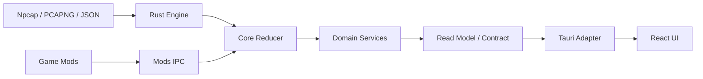

# AGENTS.md

## 0. 最小行为守则（动手前必读）

本节是全文的强制摘要；与后文冲突时，以更具体的条款为准。

1. **先确认影响层再动手**：修改前先判断属于 Rust Engine/Core、Reducer、Storage、CLI、Tauri Adapter、React、Windows、Mod、资源、CI 或文档，并遵守目录边界。
2. **Rust 核心保持唯一事实源**：抓包、解析、战斗归并、历史、资源、更新、Mod IPC 和系统集成由 Rust 权威实现；React 只做投影和交互。
3. **Tauri/React 是唯一桌面 UI**：不得恢复旧桌面 UI、`gui` Feature、根 crate GUI binary 或平行 UI 状态机。
4. **CLI 保持 UI-free**：`nte-core --features cli` 的依赖树不得出现 Tauri、WebView、React、egui、eframe、wgpu 或窗口库。
5. **状态变更必须声明 revision effect**：任何 reducer/service mutation 都必须明确它影响哪些 read model/revision；禁止根据事件名字猜“是否需要刷新”。
6. **高频路径禁止完整复制权威状态**：>= 4Hz 的投影、Channel、snapshot 路径不得 clone 完整 `CombatState` 或其它大型权威聚合；只投影需要的 DTO。
7. **热锁内禁止阻塞操作**：持 `event_gate`、capture state lock 或其它实时路径 Mutex 时，禁止磁盘 I/O、网络/进程探测、dialog、sleep、join、阻塞 send、updater/plugin RPC。
8. **外部边界永远不 panic**：文件、JSON-RPC、Mod IPC、Tauri 参数、Npcap/FFI、Win32/system probe、网络字节均视为不可信；不得由外部数据触发 `unwrap/expect/assert/panic`。
9. **所有文件/批量输入都有资源预算**：读取前校验 byte size；解析后校验 item/count/version/field size；不得无上限 `read_to_string` 后再判断。
10. **异步/长期任务必须有 owner + cancellation**：JS unsubscribe 不是唯一生命周期；窗口、session、operation 销毁时 Rust 侧必须能主动停止 worker。
11. **来源与上下文随数据冻结**：History/Replay/Update 等延迟处理对象必须携带产生时的 source/generation/context，禁止持久化时重新读取“当前值”推断来源。
12. **契约由服务端保证语义上限**：Rust Contract 必须输出合法、有界、完整的数据；TypeScript parser 用于验证，不得靠 `slice()` 静默删除协议必需记录。
13. **错误与正常负值分开表达**：system probe 的 `ProbeFailed` 不能折叠成 `false`；external error 必须有稳定 code/typed error。
14. **高频 Channel 必须写明容量和背压策略**：每个 bounded queue 明确 capacity、ordering、full policy、disconnect policy、是否允许 drop。
15. **跨边界只传稳定契约**：显式 DTO、command、Channel、event、错误码；不得直接暴露内部可变 state、裸句柄或领域内部结构。
16. **文案统一走 i18n**：核心返回稳定 code/key；简体中文继续以 `res/languages/zh-CN.json` 为翻译源。
17. **改完必须验证**：按 §18 的影响面矩阵执行；任何未运行项最终说明原因。
18. **保留无关工作树**：只修改任务相关文件；发现其它问题记录，不顺手清洗。
19. **默认不 commit/push**：除非用户明确要求，不 `git commit`、不 `git push`、不创建 PR。
20. **局部快速通道有硬性排除项**：触及 reducer、revision、`state.rs` 共享状态、live capture、history/replay、外部文件导入、CLI IPC、长期 Channel worker、锁/并发、契约版本时，禁止按普通 UI 快修处理。

---

## 0.1 变更分类与快速通道

### A. 快速通道

仅适用于：

- 纯 React 展示；
- CSS/布局；
- 既有契约内的小组件交互；
- 不改变共享状态语义的小型 command/window 适配；
- 确定性、无 I/O、无并发的小算法。

建议范围：

- 净改动 <= 200 行；
- 直接文件 <= 8；
- 不新增依赖；
- 不改变 DTO/schema/revision/lifecycle。

验证采用 focused test/typecheck/check。

### B. Hardened 通道

以下任一项出现，必须进入 Hardened 通道：

- `src/core/reducer.rs`
- `src/core/live_capture.rs`
- `src-tauri/src/state.rs`
- history/replay/capture session
- `EngineEvent` / `CoreSignal`
- generation/revision/sequence
- bounded/unbounded Channel
- `thread::spawn` / async long-running task
- Mutex/RwLock/Atomic lock ordering
- 文件导入、JSON/PCAPNG
- CLI JSON-RPC / Mod IPC
- Tauri Contract version/schema
- updater/FFI/unsafe
- shared root crate + CLI + Tauri 同时受影响

Hardened 通道必须：

1. 先列不变量；
2. 先补 regression test；
3. 明确 trust boundary；
4. 明确 lock / backpressure / lifecycle；
5. 执行完整影响面验证。

**不得因为“只有几行改动”而降级为快速通道。**

---

## 1. 适用范围与优先级

- 本文适用于整个 `NTE DPS TOOL` 仓库。
- 优先级：
  1. 用户当次明确指令；
  2. 更深层目录 `AGENTS.md`；
  3. 本文。
- 描述性架构与代码不一致时，以代码现状为准，但必须报告偏差。
- 本文的“必须 / 禁止”是规范性约束。

---

## 2. 产品与架构定位

`NTE DPS TOOL` 是 Windows 桌面实时 DPS 工具。

现行桌面栈：

```text
Tauri 2
Vite
React
TypeScript
Tailwind CSS
shadcn/ui
```

主要产物：

- `nte-dps-tool`：Tauri 桌面程序；
- `nte-core`：无 GUI stdio sidecar，Feature `cli`；
- `nte-updater`：独立更新执行程序；
- `dwmapi.dll`：游戏侧 NTE Mods Plugin；
- `desktop` Feature：共享桌面平台能力，不包含 UI framework/binary。

运行分层：



原则：

- Domain rule 不翻译到 TypeScript；
- Tauri 是 adapter，不是第二套业务核心；
- React 是 read model consumer，不是权威 state owner。

---

## 3. 不可破坏约束

- 不提交 `target/`、`logs/`、`data/`、`NTE_Assets/`、`nte-resource-exporter/`、`Dumper-7/`、`tools/`、Node `node_modules/`、C# `bin/obj`、`.env`、抓包样本、密钥、完整解包数据。
- 不把 PCAP 内容、完整 payload、用户本机完整路径、token、key 写入日志、前端 error、测试 snapshot、commit message。
- 实时抓包、JSON import、PCAPNG replay 应尽量复用同一 Engine/Reducer 语义。
- 当前自定义签名更新和 Mods Plugin 更新协议不得静默替换。
- Mod 热更新保持事务式：候选集合全部成功后原子替换；失败保留上一工作版本。
- `master` 不重新启用明确被产品关闭的研究性功能；研究内容留在 research branch。
- 资源维护/导出工具不成为主程序运行时依赖。

---

# 4. 目录与职责边界

| 能力 | 归属 | 禁止 |
| --- | --- | --- |
| 网络字节、Npcap、PCAPNG | `src/engine/` | Tauri/React 依赖 |
| 战斗模型 | `src/engine/model.rs` | 窗口/UI 状态 |
| EngineEvent 归并 | `src/core/reducer.rs` | React 逻辑 |
| Capture/Replay session | `src/core/` | WebView/window 操作 |
| History / config / files | `src/storage/` + core service | React 规则 |
| CLI JSON-RPC | `src/api/`, `src/cli/` | Tauri 类型 |
| Windows/FFI/system | `src/platform/` | React Win32 |
| Tauri commands/channels/windows | `src-tauri/src/` | 复制 reducer/history/parser |
| React UI | `frontend/src/` | 原始包解析/权威业务规则 |
| Native Mods Plugin | `native/nte-mods-plugin/` | 桌面 UI 逻辑 |

### Tauri managed state

`AppState` 只应作为组合 façade。

推荐内部结构：

```text
AppState
├── CaptureSessionService
├── PresentationState
├── HistoryService
├── SettingsService
├── EquipmentService
├── UpdateService
└── DiagnosticsService
```

若 `AppStateInner` 新增一个新领域的第 2 个以上 Mutex/Atomic 字段，必须先评估是否应该创建子 service。

---

# 5. State Mutation 与 Revision 协议

这是仓库级核心不变量。

## 5.1 每个 mutation 必须声明 effects

任何会改变权威状态的操作必须能回答：

```text
改变了什么？
哪些 read model 失效？
哪些 revision 必须推进？
哪些 Channel 应重新投影？
```

禁止：

```rust
match event {
    SomeEvent => false, // “感觉 UI 不需要刷新”
}
```

推荐：

```rust
struct MutationEffects {
    combat: bool,
    packet: bool,
    inventory: bool,
    settings: bool,
    history: bool,
    presentation: bool,
}
```

具体实现可以不同，但语义必须显式。

## 5.2 Revision 表示状态，不表示事件数量

- revision 在用户可观察状态真正改变时推进；
- 无状态变化事件不得为了“收到过”随意 bump；
- 状态改变后不得遗漏 bump；
- packet revision、combat revision、presentation revision 不混用。

## 5.3 新增 reducer 事件的测试要求

新增/修改任何 `EngineEvent` handling，测试至少覆盖：

- state mutation；
- no-op 情况；
- revision/effect；
- replay/live 一致性；
- 若会修改已存在 hit，必须覆盖“后续没有其它事件”的投影刷新。

---

# 6. 并发、锁与背压

## 6.1 热锁定义

以下属于热路径锁：

- capture `event_gate`
- authoritative `CombatState` lock
- packet/capture session 关键锁
- 其它每个 packet/hit/event 可能访问的 Mutex

## 6.2 热锁内禁止

持有热锁时禁止调用：

```text
std::fs / file persistence
serde pretty/full export of large state
process/network/system probe
file dialog
thread::sleep
JoinHandle::join
blocking channel send
updater/plugin RPC
WebView/window IPC
```

必要时：

1. 锁内 `mem::take` / 生成轻量快照；
2. 释放锁；
3. 执行慢操作；
4. 用 generation/token 合并结果。

## 6.3 锁顺序

持两个以上 Mutex 的函数必须：

- 避免反向嵌套；
- 在代码注释说明顺序或拆分；
- 不通过 helper 隐式重新获取外层锁。

推荐优先减少嵌套锁，而不是扩大 lock order 文档。

## 6.4 Channel 背压

每个 Channel/queue 定义：

```text
capacity:
ordering:
full policy:
disconnect policy:
droppable:
producer thread:
consumer thread:
```

可靠语义事件可以 backpressure，但 consumer 不得执行慢 I/O。

debug packet 可以 drop，但必须有 drop counter/diagnostic。

---

# 7. 高频路径与性能预算

## 7.1 高频定义

以下任一满足即视为高频：

- >= 4Hz 周期刷新；
- per hit / per packet；
- active combat 每个 revision；
- 多窗口同时消费同一 state。

## 7.2 高频路径禁止

- clone 完整 `CombatState`；
- clone 完整 History 集合；
- 每次刷新复制大量 String/Vec；
- 创建多个 O(N) 中间 Vec；
- 同一 revision 为多个窗口重复做相同昂贵 projection；
- 为 UI 方便在抓包线程序列化大 DTO。

## 7.3 推荐 read model

```text
Authoritative State
       ↓
revision-aware projection
       ↓
bounded DTO / page / aggregate
       ↓
Tauri Channel
```

Live state 使用 closure/read projection：

```rust
with_state(|state| project(state))
```

Paused/History 可以在状态切换时生成 `Arc` snapshot，不能每 tick 重新深拷贝。

## 7.4 Cache 规则

先消除深拷贝和多余分配，再考虑 cache。

新增 cache 必须说明：

- key/revision；
- invalidation；
- memory bound；
- stale behavior；
- 是否值得复杂度。

---

# 8. 文件、Replay 与其它 Trust Boundary

## 8.1 所有文件导入都有读取前 budget

禁止：

```rust
let text = std::fs::read_to_string(path)?;
if text.len() > LIMIT { ... }
```

必须先：

```rust
let metadata = std::fs::metadata(path)?;
if metadata.len() > LIMIT { ... }
```

然后读取。

## 8.2 解析后继续做结构预算

需要限制：

- record count；
- packet/hit/item count；
- nested arrays；
- string length（适用时）；
- version；
- numeric finite/range。

## 8.3 文件错误必须 typed

区分：

```text
NotAFile
TooLarge
UnsupportedVersion
InvalidFormat
Io
Validation
```

不使用 `String` 内容比较控制业务分支。

## 8.4 外部数据禁止 panic

以下路径上的 `unwrap/expect/assert` 默认视为审查阻断项：

- parser 输入；
- replay/import；
- CLI request；
- Mod response；
- FFI result；
- system probe；
- Tauri command payload。

只有内部、已经被同一函数前置逻辑证明的不变量可使用带原因的 `expect`。

---

# 9. History / Replay / Provenance

## 9.1 Source 必须随对象冻结

延迟任务/重试对象必须携带产生时上下文：

```rust
struct PendingArchive {
    source: CaptureQualitySource,
    ...
}
```

禁止在持久化时查询当前 `quality_source()` 反推旧数据来源。

## 9.2 Round boundary 与持久化分离

Round cutover 是实时状态事务。
History write 是持久化 side effect。

优先保证：

1. 不丢新事件；
2. 不混 round；
3. 慢盘不阻塞 capture；
4. persist failure 可 retry。

## 9.3 History Contract

服务端保证：

```text
bounded history rows + exactly one live row
```

前端只验证，不负责“修剪成正确状态”。

---

# 10. 错误模型与 panic 策略

## 10.1 Typed Error 优先

领域层优先：

```rust
Result<T, DomainError>
```

而不是：

```rust
Result<T, String>
```

只在最终日志/contract boundary 格式化。

## 10.2 false / None 不能代表 probe error

例如进程探测：

```rust
Running
NotRunning
ProbeFailed
```

不得：

```rust
game_process_is_running().unwrap_or(false)
```

如果调用点确实允许 degradation，必须：

- log error；
- 在状态/contract 中保留 degradation 标记；
- UI 不误导为正常 negative result。

## 10.3 Poison handling

现有代码允许从 poisoned Mutex 恢复时，必须确认：

- 被保护对象仍满足不变量；
- 如果不能保证，应 fail closed，而不是统一 `into_inner()`。

不要把 poison recovery 机械复制到所有新 state。

---

# 11. 长期任务与生命周期

## 11.1 Owner + Cancellation

每个长期 worker 必须记录 owner：

- window；
- capture session；
- replay operation；
- update transaction；
- plugin request group。

并有 Rust 侧 cancellation。

## 11.2 JS cleanup 不是唯一保证

React unmount 的 unsubscribe 是正常路径，但必须还能处理：

- WebView crash；
- window destroyed；
- app shutdown；
- subscription replacement；
- channel disconnect。

## 11.3 Worker registry

推荐 registry key 至少包含：

```text
owner_window
subscription_id
```

window destroyed 时能批量停止。

## 11.4 新 worker 优先 async runtime

除非必须阻塞 OS API，否则优先：

- Tauri async runtime；
- async interval；
- cancellation token/watch；

避免每个订阅一个永久 OS thread。

---

# 12. Rust 规范

- Rust 2024 + rustfmt。
- 类型 `PascalCase`，函数/变量/模块 `snake_case`，常量 `SCREAMING_SNAKE_CASE`。
- 新业务规则放到正确 domain 层，Tauri 不复制。
- 边界使用 `Result`/typed error。
- `unsafe` 最小化并有 `SAFETY:`。
- 序列化改动考虑旧 config/history/import compatibility。
- 一个函数如果同时包含 lock、I/O、projection、persistence、revision bump 中的三个以上职责，必须拆分。
- getter 名称不能隐藏 O(N) 深拷贝；昂贵操作使用 `snapshot_` / `project_` / `load_` 等明确命名。
- `paused` / `processing` / `presentation` 等状态名必须和真实语义一致。
- 第三处重复出现前不急于抽 trait；但 transaction/lifecycle/revision 这类系统性语义不能靠复制粘贴保持一致。

---

# 13. Tauri Contract / Command / Channel

## 13.1 DTO

- 显式 serde DTO；
- `camelCase`；
- 大整数安全跨 JS；
- 大列表分页/游标；
- required invariant 在 Rust 端保证；
- contract version 变化时 Rust/TS 同步。

## 13.2 Command

用于有限请求/操作：

- start/stop；
- save；
- import/export；
- settings；
- query page。

不要把持续高频流做成重复 `invoke()`。

## 13.3 Channel

用于有序持续数据。

每个 subscription：

- 有 id；
- 有 owner；
- 有 cancel；
- replacement 能停旧 worker；
- window destroy 能停；
- disconnect 能停。

## 13.4 Contract parser

TypeScript parser：

- 验证 unknown data；
- 验证 enum/range/invariant；
- contract 不合法时 fail loudly；
- 不通过 `slice/default/?? []` 静默隐藏后端协议错误，除非字段明确 optional/backward-compatible。

---

# 14. TypeScript / React

## 14.1 TypeScript

- `strict`；
- 禁止无说明 `any` / `@ts-ignore`；
- 外部数据只在 typed client boundary parse 一次；
- 页面不直接裸 `invoke()`；
- DTO 优先单一 schema/generated source，避免手写漂移。

## 14.2 React

- render 纯函数；
- Channel/timer/window 在 effect/hook 中完整 cleanup；
- Rust authoritative snapshot 与 UI-only state 分开；
- 不订阅一个巨型 object 导致全树刷新；
- selector 保持稳定引用；
- loading/empty/error/stale 都显式处理。

## 14.3 External Store

跨窗口/异步目录类资源使用显式 store：

```text
subscribe
getSnapshot/revision
resolve/select
```

禁止依赖：

- mutable exported function identity；
- `cloneElement` 强制刷新；
- 隐式全局变量 mutation 作为 notification。

---

# 15. UI / shadcn / i18n / Windows

保留现行原则：

- 优先 shadcn/ui + NTE 组合组件；
- 语义 Tailwind token，不散落主题常量；
- 透明、穿透、置顶、快捷键、多屏 DPI、窗口恢复由 Rust/Tauri 协调；
- React 只发送意图；
- user-visible 文案走统一 i18n；
- 英文字符串作为稳定 key，简中在 `res/languages/zh-CN.json`；
- HUD/window 平台行为需要人工验收；
- Dialog/Sheet/Drawer 有标题和可访问性；
- 图标按钮有 Tooltip 或 `aria-label`；
- loading/empty/error 使用统一组件。

---

# 16. AppState 规模控制

`AppState` 是 composition façade，不是功能堆放区。

## 16.1 新字段准入

新增以下任一项前必须评估 service：

- 一个新领域的 Mutex；
- 一个新领域的 Atomic revision；
- 一个新领域的 undo/cache/runtime state；
- 一个新领域的 transaction lock。

如果同一领域已有 2 个以上相关字段，默认拆成 struct/service：

```rust
struct HistoryRuntime { ... }
struct PresentationRuntime { ... }
```

## 16.2 façade 迁移

重构时可以保留：

```rust
impl AppState {
    fn ...
}
```

作为短期 façade，内部转发到 service，避免一次性修改所有 command。

## 16.3 禁止一次性“大爆炸”重构

不因发现 God Object 就同时移动所有 state。
按领域逐个迁移，每次保持可测试、可回滚。

---

# 17. 测试要求

## 17.1 新状态 mutation

至少测试：

- success；
- no-op；
- boundary；
- error；
- revision effect。

## 17.2 新外部输入

至少测试：

- valid；
- malformed；
- empty/null；
- too large / too many；
- unsupported version；
- stale/duplicate（适用时）；
- failure 后进程继续可用。

## 17.3 新并发/lifecycle

至少测试：

- normal stop；
- duplicate stop；
- owner destroyed；
- replacement；
- disconnect；
- operation failure；
- no leaked registry entry。

## 17.4 History/replay

至少测试：

- live/json/pcapng source；
- retry 后 source 不变；
- round cutover 不丢新 hit；
- persist failure 不阻塞 capture。

## 17.5 性能热点

测试不强依赖 CI 毫秒阈值。
优先验证结构性不变量：

- 无完整 state clone；
- bounded output；
- 单扫描；
- 无锁内 I/O。

---

# 18. 验证矩阵

## 18.1 快速通道

纯 React/UI：

```text
Prettier/format
typecheck
focused Vitest
```

小 Tauri adapter 且不触及 Hardened 项：

```powershell
cargo fmt --check --manifest-path src-tauri/Cargo.toml
cargo check --manifest-path src-tauri/Cargo.toml
```

## 18.2 Hardened 通道

涉及 core/reducer/history/replay/concurrency/contract 时，最终代码至少执行：

```powershell
cargo fmt --check
cargo check
cargo test
cargo clippy --all-targets --features desktop -- -D warnings

cargo check --bin nte-core --no-default-features --features cli
cargo test --no-default-features --features cli
cargo clippy --all-targets --no-default-features --features cli -- -D warnings

cargo fmt --check --manifest-path src-tauri/Cargo.toml
cargo check --manifest-path src-tauri/Cargo.toml
cargo test --manifest-path src-tauri/Cargo.toml
cargo clippy --manifest-path src-tauri/Cargo.toml --all-targets -- -D warnings

pnpm --dir frontend lint
pnpm --dir frontend typecheck
pnpm --dir frontend test

pwsh -NoProfile -File scripts/verify_architecture.ps1
```

如果仓库存在：

```text
scripts/verify_runtime_safety.ps1
```

Hardened 通道必须同时运行。

涉及 frontend entry/build config：

```powershell
pnpm --dir frontend build
```

涉及 native plugin：执行现有 Release x64 MSBuild 验证。

---

# 19. Code Review 必查清单

每次 Hardened review 必须逐项回答。

### Correctness

- [ ] 所有 state mutation 都有 revision/effect？
- [ ] no-op 会不会误 bump？
- [ ] replay/live 行为一致？
- [ ] source/generation 是否在正确时间冻结？

### Exception / Boundary

- [ ] 外部输入能否触发 panic？
- [ ] 文件是否读取前限 size？
- [ ] 结构是否限 count/version？
- [ ] probe error 是否被折叠成 false/None？

### Concurrency

- [ ] 是否持锁 I/O/sleep/join/send？
- [ ] 锁顺序是否可证明？
- [ ] bounded queue full 后发生什么？
- [ ] owner 消失 worker 是否退出？

### Performance

- [ ] 高频路径是否 clone 大 state？
- [ ] 是否 O(N) + 深分配？
- [ ] 同一 revision 是否重复昂贵 projection？
- [ ] DTO 是否有明确上限？

### Contract

- [ ] Rust 是否保证 invariant？
- [ ] TS parser 是否只是验证而非静默修复？
- [ ] schema/version 是否同步？
- [ ] required row/record 是否可能被裁掉？

### Maintainability

- [ ] 新代码是否继续扩大 God Object？
- [ ] `Result<_, String>` 是否应 typed？
- [ ] 名称是否准确反映真实语义？
- [ ] 是否复制了 transaction/subscription 逻辑？

任何一项无法回答，都不能以“代码很小”跳过。

---

# 20. CI / Policy 建议

除现有 `verify_architecture.ps1` 外，建议维护：

```text
scripts/verify_runtime_safety.ps1
```

用于检查可机械发现的模式，例如：

- desktop 高频 projection 禁止 `with_state(Clone::clone)`；
- Channel 目录新增裸 `thread::spawn + sleep` 需要 whitelist；
- Replay import 必须经过 size validation；
- required contract list 不允许前端 silent slice；
- 已知 external boundary 文件新增 `expect/unwrap/assert` 提醒 review。

脚本是辅助，不代替代码审查。

---

# 21. 依赖、构建与发布策略

- 新增/升级 Rust、Node、Tauri plugin、shadcn dependency 前说明用途、维护状态、许可证、体积和替代方案，并获得用户确认。
- 使用 lockfile 对应 package manager，禁止混用 npm/pnpm/yarn/bun。
- CLI-only dependency tree 不得引入 desktop UI crate。
- 保留 release profile、LTO、`panic = "abort"` 的现有发行意图。
- Tauri/React/Tailwind/shadcn 大版本升级必须单独验证。
- updater protocol、`vendor/`、`[patch]` 不在普通任务中修改。

---

# 22. 禁止事项

除非用户明确要求，禁止：

- `git commit` / `git push` / 创建 PR；
- 恢复旧 GUI；
- React 复制 Rust 领域算法；
- Tauri 复制 reducer/history/parser；
- 每 hit/packet/frame `invoke`；
- 高频路径 clone `CombatState`；
- 热锁内 I/O / sleep / join / blocking send；
- external boundary `expect/unwrap/assert`；
- 无上限整文件读取；
- 前端 `slice()` 静默修复 required contract data；
- 用 `false` 表示 system probe error；
- 长期任务没有 Rust owner/cancel；
- 为方便把新 Mutex/Atomic 持续塞进 `AppStateInner`；
- 无关整仓格式化、依赖升级、主题清洗；
- 修改 updater protocol / vendor / Cargo patch 而无明确请求；
- 用 cache 掩盖本可消除的全量 clone；
- 为“事务一致性”把持久化塞入实时锁。

---

# 23. 最终交付规范

非快速通道最终回复包含：

1. 改动摘要和影响范围；
2. 文件清单；
3. 已运行验证命令及结果；
4. 未运行验证及原因；
5. 需要人工验证的点；
6. Hardened 项相关不变量是否满足。

快速通道可精简，但不得隐藏未验证项。

---

# 24. 仓库长期目标

任何新功能都应尽量让系统朝以下结构收敛：

```text
Authoritative Rust Domain State
          ↓
explicit mutation effects
          ↓
bounded / revisioned read models
          ↓
typed Tauri contracts
          ↓
React projection
```

同时保持：

```text
实时路径 ≠ 持久化路径
外部输入 ≠ 内部不变量
窗口生命周期 ≠ JS cleanup
当前 session context ≠ 延迟任务 provenance
contract validation ≠ silent repair
```

只要新代码违反其中任一等式，就必须进入 Hardened review，而不是作为普通局部修复合入。
