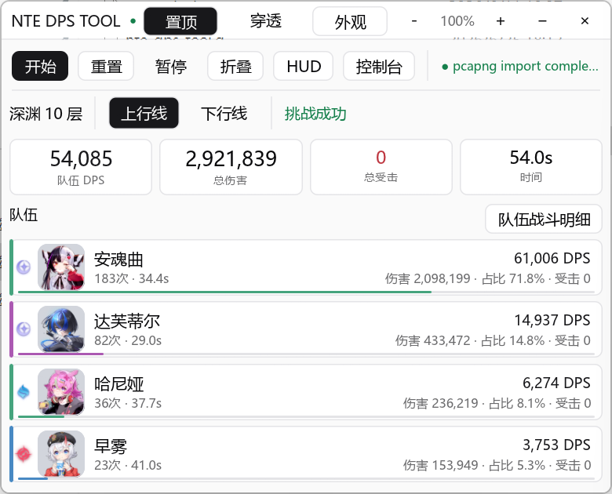
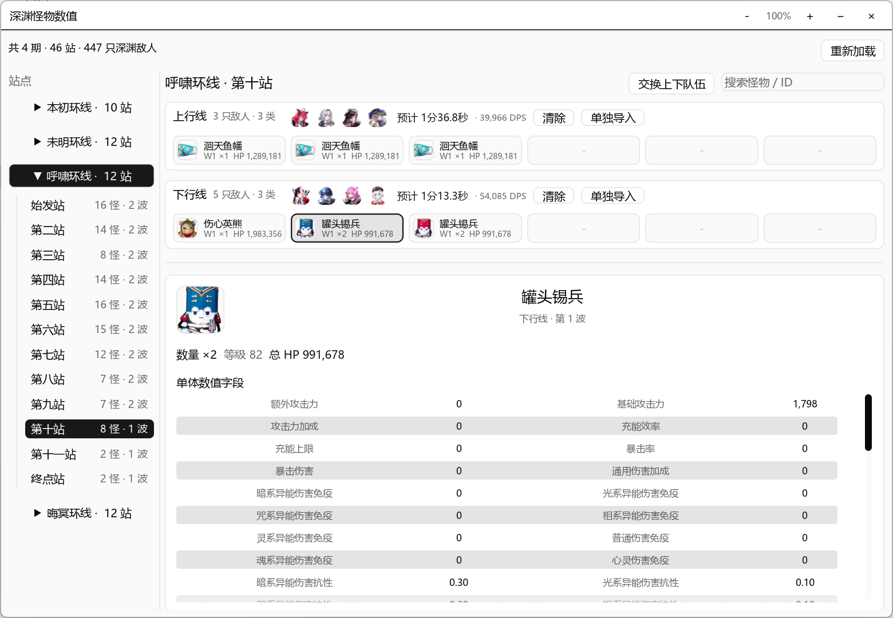
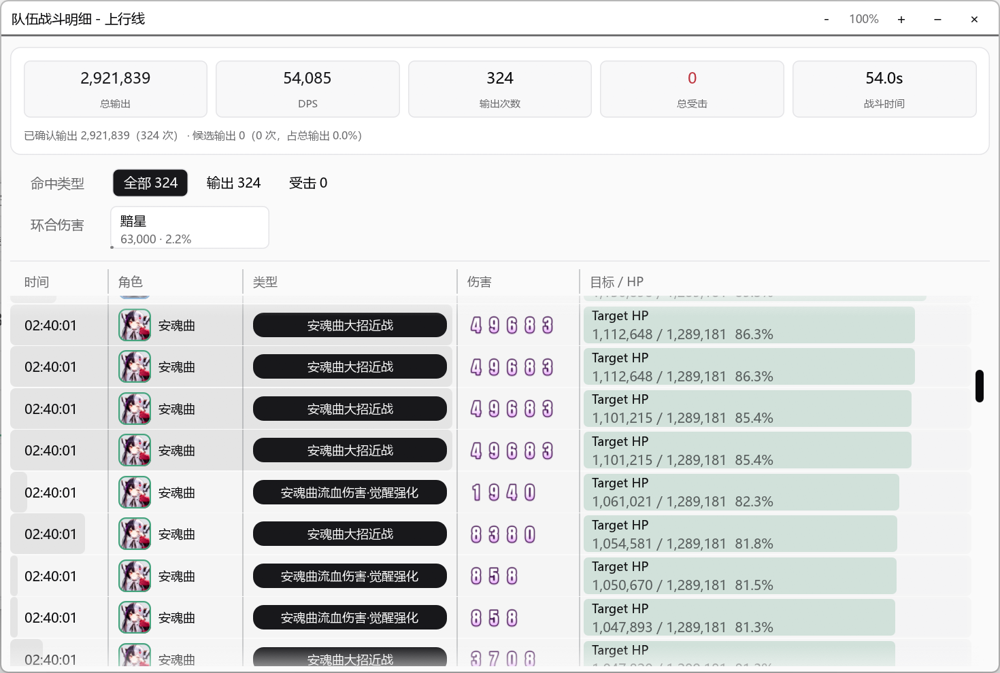
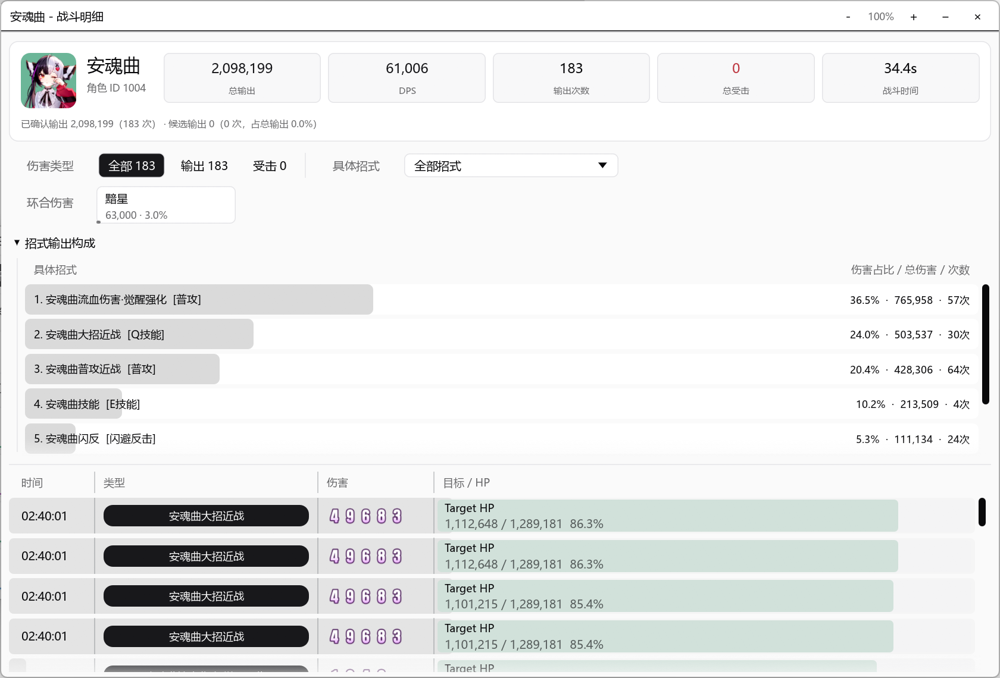

# NTE DPS TOOL

Rust + egui 实现的 NTE 本地 DPS 诊断工具。工具在用户本机运行，通过 Npcap 读取本机相关 UDP 流量，提取伤害、深渊事件和部分 GameplayEffect 统计，并在本地展示总览、角色、技能、命中明细和深渊上下行线统计。

本项目为独立社区工具，与 NTE 游戏发行方、开发方、平台方或相关权利方无从属、授权、背书或合作关系。

## 功能

- 实时统计总伤害、DPS、命中数、受击统计和战斗时长。
- 按角色展示伤害、占比、命中数、DPS、受击统计、技能分类和可筛选命中明细。
- 支持“扣除时停”和“现实时间”两种 DPS 时间口径，大招动画时停使用资源表时长，额外时停按解析到的区间合并扣除。
- 保留目标 HP 数值字段：`target_hp_before`、`target_hp_after`、`target_max_hp`、`target_hp_percent`。
- 解析并展示 GameplayEffect 映射、技能分类、`ability_name`、`damage_name`、`attack_type`。
- 深渊上行线/下行线独立统计，保留重开、进入线路、通关和离开事件状态，并提供深渊怪物数值表查看。
- 深渊数值表支持按上下行线估算清怪时间、按目标时间反推所需 DPS，并按波次展示静态 HP 占比。
- Console 提供战斗时间轴、技能占比、解析质量和本地历史页；历史页可手动保存脱敏战斗摘要、查看详情、对比两条记录，并把历史队伍用于深渊预测。
- 将 `GA_CardTrigger_*` / `GE_AbyssCard_*_Damage` 这类异境补给站可选场地 Buff 伤害归类为 `深渊场地Buff`，避免混入角色技能或创生花。
- 实时保存完整 Ethernet 帧到 `logs/nte_raw_*.pcapng`。
- 支持导出解析后的 JSON、另存完整 PCAPNG，支持导入 JSON 和 PCAPNG 进行 Debug 回放。
- Debug 面板可查看封包端点、角色声明、解析结果和载荷预览。
- Debug 面板支持编辑或新增 `res/data/characters/characters.json` 角色数据，支持打开、搜索、编辑并保存 NTE 加密 INI。
- Debug 面板提供资源覆盖率检查、自动诊断向导、网卡列表、原始抓包路径、服务端伤害校准开关和导入导出入口；诊断和资源报告支持复制脱敏文本。
- HUD 支持自定义显示模块、最大角色数和小型 DPS 曲线，默认保持总 DPS、时间、总伤害和角色排行。
- 自动保存透明度、深浅色主题、窗口置顶和服务端伤害校准设置到 `%LOCALAPPDATA%\NTE DPS Tool\config.json`。
- 支持 Home 快捷键切换鼠标穿透；Debug 构建支持 F12 打开/关闭 Debug 面板。
- 根据 `HTGame.exe` 的活动连接自动选择网卡和本机 IP。

具体敌方目标识别与场景识别仍在研究中。

## 许可与使用范围

项目自有代码和文档采用 [PolyForm Noncommercial License 1.0.0](LICENSE)，仅允许非商用使用。因为许可证限制商用，本项目属于 source-available/noncommercial，不是 OSI 意义上的开源许可证项目。

禁止在未取得单独书面授权的情况下销售本工具、提供付费托管/代跑/数据服务、打包进商业产品、用于商业竞品分析或作为商业服务的一部分分发。

第三方库、运行组件和资源文件保留各自许可和权利声明，见 [THIRD_PARTY_LICENSES.md](THIRD_PARTY_LICENSES.md) 与 [NOTICE.md](NOTICE.md)。

## 环境

- Windows 10/11
- Rust 1.85 或更高版本
- [Npcap](https://npcap.com/)，建议启用 WinPcap API-compatible Mode
- 实时抓包可能需要以管理员身份运行

## 运行

```powershell
git clone https://github.com/kongbaiz/NTE_DPS_TOOL.git
cd NTE_DPS_TOOL
cargo test
cargo run --release
```

普通使用只需要 Rust、Npcap 和仓库内的 `res` 资源。不需要客户端导出树、CUE4Parse、FModel、Python、Npcap SDK、资源导出 AES key 或 usmap。Debug 面板的加密 INI 编辑器使用代码内置的稳定 INI 协议 key，不需要用户提供资源导出密钥。

开始实时抓包后，程序会把通过当前 BPF 过滤器的原始帧写入 `logs/nte_raw_*.pcapng`。Debug 面板可导入完整 PCAPNG 或解析 JSON，并使用与实时抓包相同的稳定解析流程；停止抓包后可另存当前完整 PCAPNG。

Console 历史页的“保存本次摘要”会把脱敏统计写入软件目录下的 `history\`。历史记录只包含统计结果、角色摘要、技能摘要、深渊上下行摘要和解析质量摘要，不包含原始包、payload、decoded text、IP、端口、本机路径或资源授权信息。深渊预测基于静态怪物 HP 和所选队伍 DPS 估算，不包含无敌、转阶段、走位和机制时间。

Debug 构建的诊断页可运行自动诊断向导，逐项检查 Npcap 设备、HTGame.exe 活动连接、抓包状态、原始包写入和伤害解析状态。可复制的诊断报告只包含状态和建议，不包含本机 IP、网卡 GUID、完整路径、payload 或端口。

请勿把 `logs/`、`target/`、`data/`、本机抓包、完整载荷、授权资源路径、资源导出密钥、usmap 或完整解包数据提交到仓库、Issue、PR 或公开报告。

## 界面截图

| 主界面 | 深渊统计 |
|---|---|
|  |  |

| 队伍命中明细 | 角色命中明细 |
|---|---|
|  |  |

## 资源目录

```text
res/
  data/characters/   角色配置
  data/skills/       GameplayEffect、技能、伤害名称和分类映射
  data/reactions/    环合反应和反应图片配置
  data/abyss/        深渊怪物静态表、数值表和字段中文名
  images/characters/ 角色头像
  images/attributes/ 属性图标
  images/font/       游戏伤害数字字体素材
  images/monsters/   深渊怪物头像
  images/reactions/  环合反应文字素材
  icons/             应用图标
```

程序会从当前目录或可执行文件上级目录查找 `res`。角色、属性、伤害数字、反应文字和深渊怪物图片会在编译时内嵌，作为外部图片缺失时的降级资源。

## 资源维护

普通运行只依赖仓库内 `res/`。资源导出、CUE4Parse probe、NTE_Assets 后处理和清单分析脚本已迁出到独立私有仓库 `kongbaiz/nte-resource-exporter`，避免主程序仓库携带资源解包工具链、usmap、授权 key 或完整导出树。

Debug 构建的资源页只检查当前可分发运行资源：角色头像/属性、技能中文名、技能到 GE 映射、深渊怪物头像和反应文字素材。该面板不会调用 Python，也不会访问授权客户端导出目录、AES key 或 usmap。

脚本生成的 `target`、`logs`、`NTE_Assets`、C# `bin/obj`、第三方工具目录、资源导出 AES key、usmap 和解包数据不应提交。需要更新 `res/` 时，在资源工具仓库生成确认可分发的稳定资源后，只同步必要的 `res/` 文件到本仓库。

顶层 `NTE_封包解析算法.md` 是降敏后的维护摘要，只记录解析模块的公开设计边界。更细的样本、特征、偏移、函数名和抓包对照不应随公开仓库发布。

## 验证

```powershell
cargo fmt --check
cargo check
cargo test
```

依赖真实抓包的诊断测试默认忽略。需要运行时设置 `NTE_TEST_CAPTURE=<pcapng-path>`，再执行：

```powershell
cargo test -- --ignored
```
