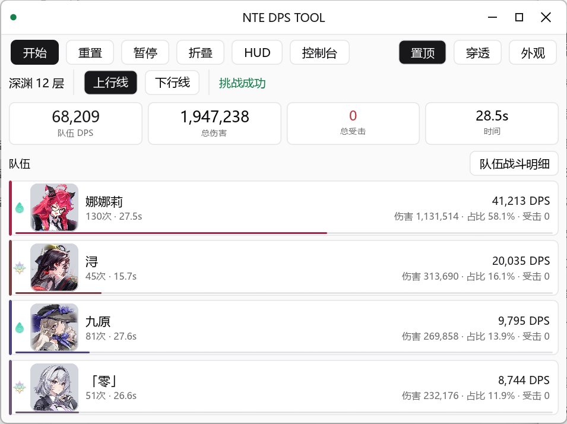
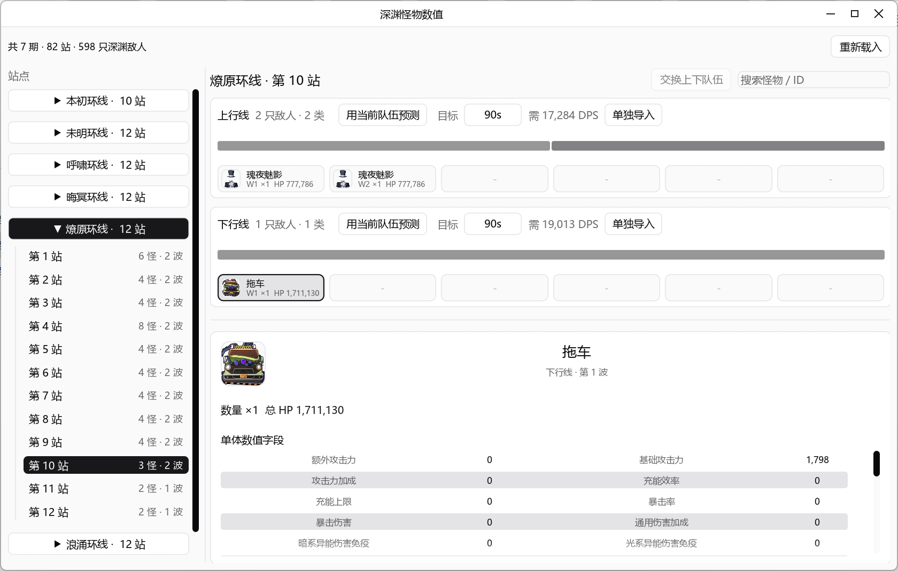
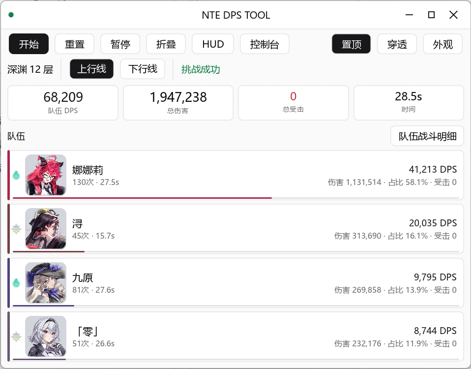
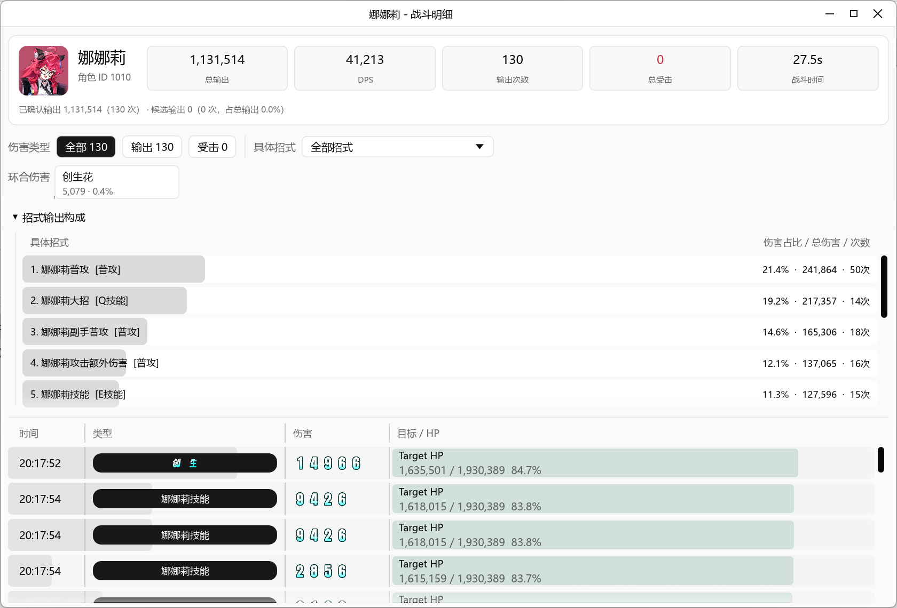
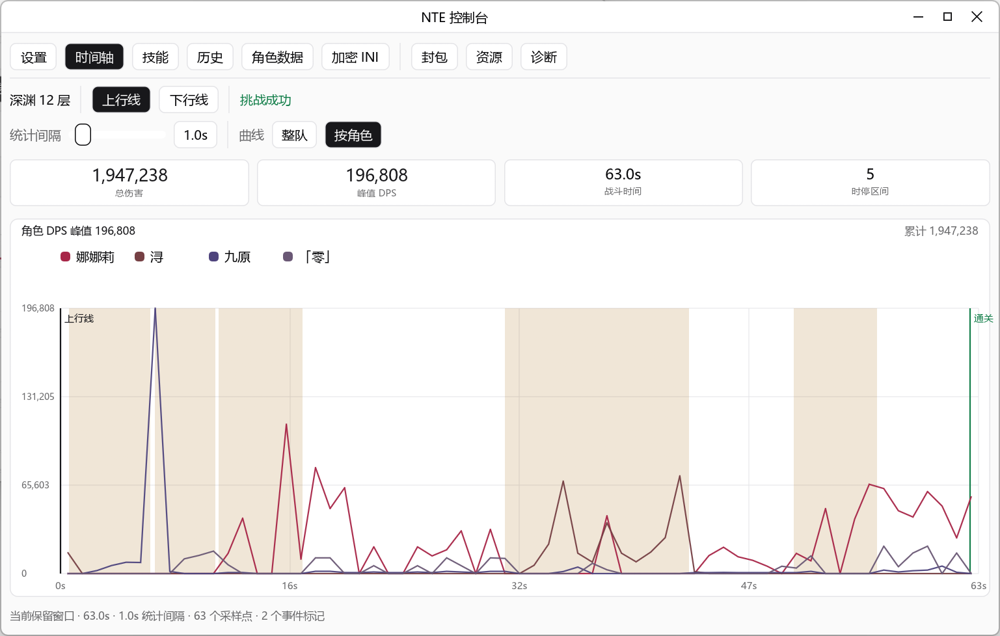
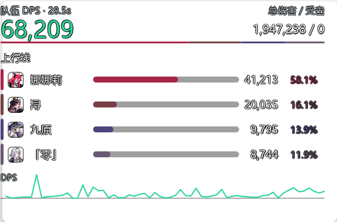

<div align="center">

<!-- LOGO / BANNER 占位区域：可替换为项目横幅图 -->


# NTE DPS Toolkit

**实时 DPS 伤害分析与战斗诊断工具** · 基于 Rust + egui，本机运行

**中文** | [English](README_EN.md)

**[官网 / 项目主页 →](https://dps.o-na-ni.com/)**

<!-- Shields 徽章 -->
[](LICENSE)
[](LICENSING.md)
[](#运行环境)
[](https://www.rust-lang.org/)
[](https://github.com/emilk/egui)
[](https://npcap.com/)
[](https://github.com/kongbaiz/nte-dps-toolkit)

</div>

> **关键词**：NTE DPS Toolkit · DPS Tool · DPS Analyzer · DPS 伤害统计 · 实时伤害分析 · 战斗诊断 · 封包解析 · Npcap · egui

---

## 项目简介

**NTE DPS Toolkit** 是一个使用 **Rust + egui** 实现的 NTE 本地 **DPS（每秒伤害）分析与诊断工具**。它完全在用户本机运行，通过 [Npcap](https://npcap.com/) 读取本机相关 UDP 流量，提取伤害、深渊事件和部分 GameplayEffect 统计，并在本地以图形界面展示总览、角色、技能、命中明细和深渊上下行线统计。

作为一款 **DPS Analyzer（伤害分析器）**，它面向希望复盘战斗数据、优化输出循环和分析配队表现的玩家与研究者，提供实时统计、历史对比和深渊预测等工作流。

> 本项目为独立社区工具，与 NTE 游戏发行方、开发方、平台方或相关权利方**无从属、授权、背书或合作关系**。

---

## 功能特点

- **实时 DPS 统计**：实时计算总伤害、DPS、命中数、受击统计和战斗时长。
- **角色维度分析**：按角色展示伤害、占比、命中数、DPS、受击统计、技能分类和可筛选命中明细。
- **双时间口径**：支持"扣除时停"和"现实时间"两种 DPS 时间口径；大招动画时停使用资源表时长，额外时停按解析到的区间合并扣除。
- **目标 HP 字段保留**：`target_hp_before`、`target_hp_after`、`target_max_hp`、`target_hp_percent`。
- **技能与效果映射**：解析并展示 GameplayEffect 映射、技能分类、`ability_name`、`damage_name`、`attack_type`。
- **深渊上/下行线统计**：独立统计上下行线，保留重开、进入线路、通关和离开事件状态，并提供深渊怪物数值表查看。
- **深渊预测**：按上下行线估算清怪时间、按目标时间反推所需 DPS，并按波次展示静态 HP 占比。
- **Console 复盘面板**：提供战斗时间轴、技能占比、解析质量和本地历史页；历史页可手动保存脱敏战斗摘要、查看详情、对比两条记录，并把历史队伍用于深渊预测。
- **场地 Buff 归类**：将 `GA_CardTrigger_*` / `GE_AbyssCard_*_Damage` 这类异境补给站可选场地 Buff 伤害归类为 `深渊场地Buff`，避免混入角色技能或创生花。
- **抓包与回放**：实时保存完整 Ethernet 帧到 `logs/nte_raw_*.pcapng`；支持导出解析后的 JSON、另存完整 PCAPNG，并导入 JSON / PCAPNG 进行 Debug 回放。
- **Debug 工具**：查看封包端点、角色声明、解析结果和载荷预览；可编辑角色数据 `res/data/characters/characters.json`，打开/搜索/编辑并保存 NTE 加密 INI；提供资源覆盖率检查、自动诊断向导、网卡列表、服务端伤害校准开关等。
- **可定制 HUD**：自定义显示模块、最大角色数和小型 DPS 曲线，默认保持总 DPS、时间、总伤害和角色排行。
- **自动持久化**：透明度、深浅色主题、窗口置顶和服务端伤害校准设置保存到 `%LOCALAPPDATA%\NTE DPS Tool\config.json`。
- **快捷键**：`Home` 切换鼠标穿透；Debug 构建支持 `F12` 打开/关闭 Debug 面板。
- **自动选网卡**：根据 `HTGame.exe` 的活动连接自动选择网卡和本机 IP。

> 具体敌方目标识别与场景识别仍在研究中。

---

## 使用场景

- **战斗复盘**：记录单场战斗的总伤害、DPS 曲线和命中明细，找出输出循环的瓶颈。
- **配队评估**：按角色对比伤害占比与技能贡献，验证不同队伍的输出表现。
- **深渊规划**：用历史队伍 DPS 与静态怪物 HP 估算清怪时间，或反推达成目标时间所需的 DPS。
- **数据研究**：导出 JSON / PCAPNG 离线分析，或导入样本做可复现的解析回放与调试。

---

## 运行环境

- **操作系统**：Windows 10 / 11
- **Rust**：1.85 或更高版本
- **抓包驱动**：[Npcap](https://npcap.com/)，建议启用 *WinPcap API-compatible Mode*
- **权限**：实时抓包可能需要以管理员身份运行

普通使用只需要 Rust、Npcap 和仓库内的 `res` 资源。**不需要**客户端导出树、CUE4Parse、FModel、Python、Npcap SDK、资源导出 AES key 或 usmap。Debug 面板的加密 INI 编辑器使用代码内置的稳定 INI 协议 key，不需要用户提供资源导出密钥。

---

## 安装方式

```powershell
git clone https://github.com/kongbaiz/nte-dps-toolkit.git
cd nte-dps-toolkit
cargo test
cargo run --release
```

---

## 使用方法

1. 安装 [Npcap](https://npcap.com/) 并启用 *WinPcap API-compatible Mode*。
2. 以管理员身份运行程序（实时抓包通常需要）。
3. 启动 NTE 客户端（`HTGame.exe`）；工具会根据其活动连接自动选择网卡和本机 IP。
4. 在主界面开始实时抓包，程序会把通过当前 BPF 过滤器的原始帧写入 `logs/nte_raw_*.pcapng`。
5. 在总览 / 角色 / 深渊等页签查看实时统计；在 Console 历史页保存或对比脱敏战斗摘要。

开始抓包后，Debug 面板可导入完整 PCAPNG 或解析 JSON，并使用与实时抓包相同的稳定解析流程；停止抓包后可另存当前完整 PCAPNG。

---

## 配置说明

应用配置自动保存到：

```text
%LOCALAPPDATA%\NTE DPS Tool\config.json
```

包含透明度、深浅色主题、窗口置顶、服务端伤害校准等设置，无需手动编辑即可在下次启动时恢复。

资源目录结构：

```text
res/
  data/characters/   角色配置
  data/skills/       GameplayEffect、技能、伤害名称和分类映射
  data/reactions/    环合反应和反应图片配置
  data/abyss/        深渊怪物静态表、数值表和字段中文名
  images/characters/ 角色头像
  images/attributes/ 属性图标
  images/font/       游戏伤害数字字体素材
  images/monsters/   深渊怪物头像
  images/reactions/  环合反应文字素材
  icons/             应用图标
```

程序会从当前目录或可执行文件上级目录查找 `res`。角色、属性、伤害数字、反应文字和深渊怪物图片会在编译时内嵌，作为外部图片缺失时的降级资源。

---

## 示例

### 界面截图

| 主界面 | 深渊统计 |
|---|---|
|  |  |

| 队伍命中明细 | 角色命中明细 |
|---|---|
|  |  |

| 战斗时间轴 | 可定制 HUD |
|---|---|
|  |  |

### 验证构建

```powershell
cargo fmt --check
cargo check
cargo test
```

依赖真实抓包的诊断测试默认忽略。需要运行时设置 `NTE_TEST_CAPTURE=<pcapng-path>`，再执行：

```powershell
cargo test -- --ignored
```

---

## 常见问题（FAQ）

**Q：抓不到任何流量 / 没有数据？**
A：确认已安装 Npcap 并启用 *WinPcap API-compatible Mode*，以管理员身份运行，并已启动 `HTGame.exe`。Debug 构建的诊断页可运行自动诊断向导，逐项检查 Npcap 设备、活动连接、抓包状态、原始包写入和伤害解析状态。

**Q：需要游戏资源导出 key、usmap 或 Python 吗？**
A：不需要。普通运行只依赖仓库内 `res/` 与代码内置的稳定协议 key。

**Q：历史记录会包含敏感信息吗？**
A：不会。Console 历史页"保存本次摘要"只写入脱敏统计（统计结果、角色/技能摘要、深渊上下行摘要、解析质量摘要），**不包含**原始包、payload、decoded text、IP、端口、本机路径或资源授权信息。

**Q：深渊预测准确吗？**
A：预测基于静态怪物 HP 和所选队伍 DPS 估算，**不包含**无敌、转阶段、走位和机制时间，仅作参考。

**Q：这是外挂吗？**
A：不是。本工具仅被动读取本机网络流量进行统计展示，不注入、不修改、不向游戏发送任何数据。

---

## 贡献指南

欢迎提交 Issue 和 Pull Request。提交前请注意：

- 运行 `cargo fmt --check`、`cargo check` 和 `cargo test` 确保通过。
- **请勿提交敏感数据**：`logs/`、`target/`、`data/`、本机抓包、完整载荷、授权资源路径、资源导出密钥、usmap 或完整解包数据不应提交到仓库、Issue、PR 或公开报告。
- 资源导出、CUE4Parse probe、`NTE_Assets` 后处理等工具链已迁出到独立私有仓库 `kongbaiz/nte-resource-exporter`；需要更新 `res/` 时，只同步必要的可分发资源文件。
- 顶层 `NTE_封包解析算法.md` 是降敏后的维护摘要，只记录解析模块的公开设计边界；更细的样本、特征、偏移、函数名和抓包对照不应随公开仓库发布。

---

## License

本项目采用**双重授权**(详见 [LICENSING.md](LICENSING.md)):

- **开源授权 — [GNU AGPL v3.0](LICENSE)**:你可以自由使用、修改和再分发本项目,**包括商业用途**。但根据 AGPL 的 **Copyleft** 条款:一旦你分发本软件、其修改版,**或让用户通过网络(SaaS)使用修改版**,就必须以 AGPL 公开**完整的对应源码**。简而言之——你可以商用,但**不能**用它做闭源产品或服务。
- **商业授权**:若需以 AGPL 不允许的方式使用(如并入**闭源**产品、提供不公开源码的商业托管服务),请向版权方单独获取商业授权——在仓库提交带 `commercial-license` 标签的 Issue,联系方式详见 [LICENSING.md](LICENSING.md)。

第三方库、运行组件和资源文件保留各自许可和权利声明,见 [THIRD_PARTY_LICENSES.md](THIRD_PARTY_LICENSES.md) 与 [NOTICE.md](NOTICE.md)。

---

<div align="center">
<sub>NTE DPS Toolkit · DPS Analyzer & 战斗诊断工具 · 由社区维护，与 NTE 官方无关</sub>
</div>
