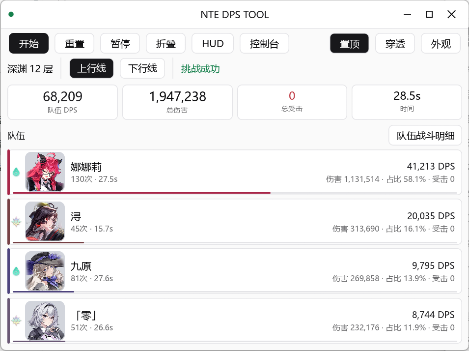
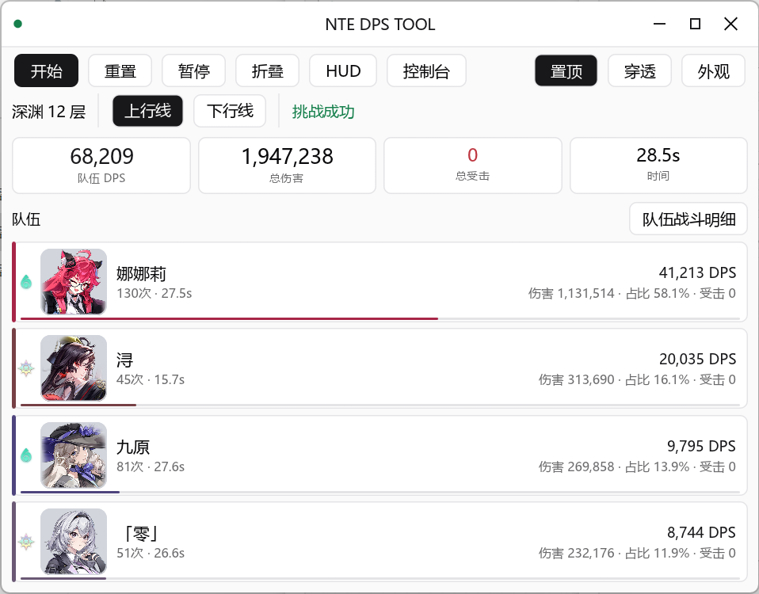
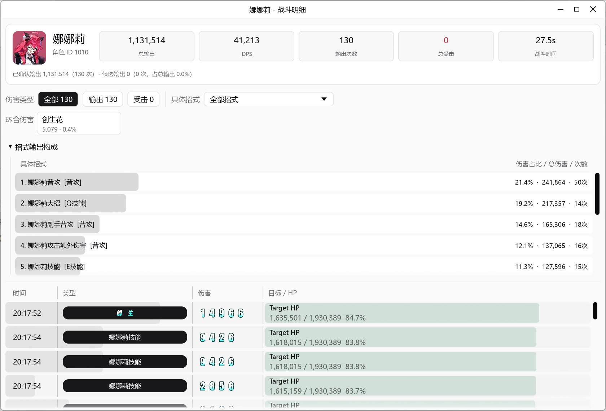
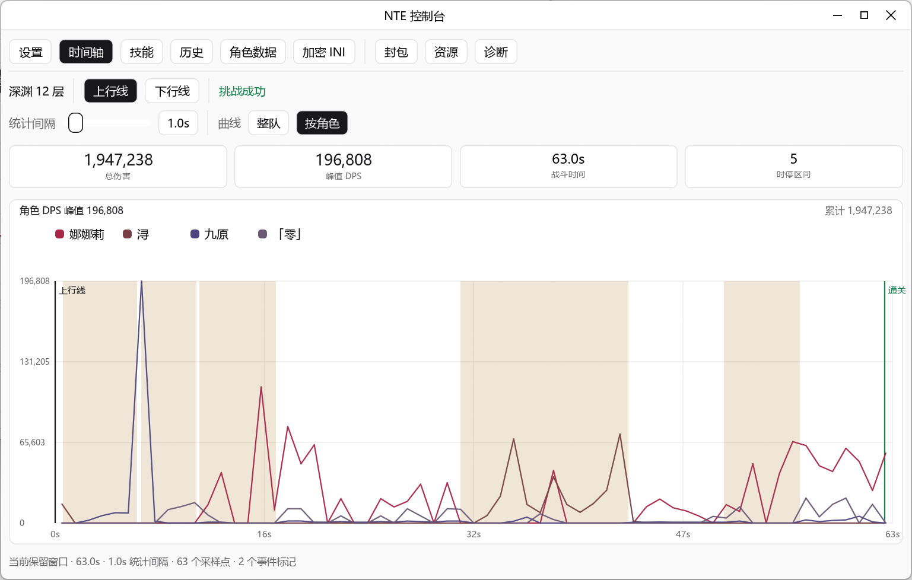
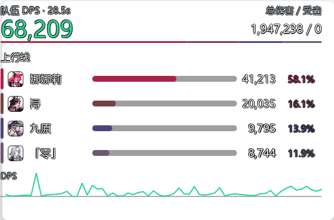
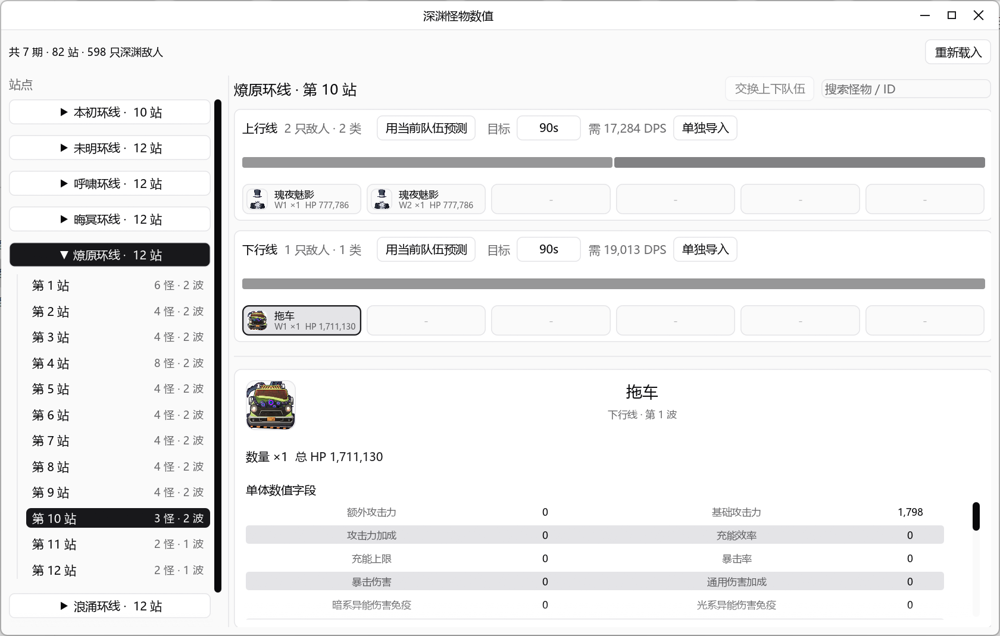

<div align="center">


# NTE DPS Toolkit

**《异环》/ Neverness to Everness 本地实时 DPS 与战斗分析工具**

**中文** | [English](README_EN.md)

[](https://github.com/kongbaiz/nte-dps-toolkit/releases/latest)
[](#快速开始)
[](LICENSE)
[](LICENSING.md)
[](https://github.com/kongbaiz/nte-dps-toolkit)

[**下载 Windows 版**](https://github.com/kongbaiz/nte-dps-toolkit/releases/latest) · [**官网 / 项目主页**](https://dps.o-na-ni.com/) · [**视频演示**](https://www.bilibili.com/video/BV1YRNP6SEG5/)

</div>

<p align="center">
  
</p>

NTE DPS Toolkit 用于记录和解释一场战斗中**伤害从哪里来、输出循环损失在哪里、不同队伍为什么表现不同**。它可实时统计角色与技能伤害，保存战斗历史，对比两次记录，并辅助估算深渊清线时间。

- **本机运行**：战斗数据默认保存在本地，不需要账号，也不会默认上传。
- **轻量常驻**：现行桌面端已由 egui 重构为 Tauri + React；开发者测试环境下，空闲内存约 **50 MB**，约为旧版的六分之一。实际占用会随系统、WebView 版本和启用功能变化。
- **面向实战**：不仅显示总 DPS，还提供角色、技能、命中明细、时间轴、历史对比和深渊预测。
- **开源可审计**：抓包、解析、桌面端和本地 Sidecar 均可在仓库中检查。

> 本项目为独立社区工具，与 NTE 游戏发行方、开发方、平台方或相关权利方无从属、授权、背书或合作关系。

---

## 它可以帮你做什么

| 场景 | 能得到的结果 |
|---|---|
| **战斗复盘** | 总伤害、有效 DPS、战斗时间、DPS 曲线和逐次命中明细 |
| **角色与技能分析** | 角色伤害占比、技能分类、GameplayEffect 映射和可筛选明细 |
| **输出循环对比** | 保存两场脱敏摘要，比较队伍、角色、技能和时间差异 |
| **深渊规划** | 独立记录上/下行线，估算清怪时间，并反推目标时间所需 DPS |
| **问题诊断** | 导入或导出 JSON / PCAPNG，复现解析问题并检查数据质量 |

---

## 快速开始

### 1. 安装 Npcap

安装 [Npcap](https://npcap.com/)，建议勾选 **WinPcap API-compatible Mode**。

### 2. 下载普通玩家版本

前往 [Releases](https://github.com/kongbaiz/nte-dps-toolkit/releases/latest)，下载：

```text
nte-dps-tool-windows-x64.zip
```

解压到一个可写目录，然后运行：

```text
nte-dps-tool.exe
```

> **普通玩家不要下载 `nte-core-windows-x64.zip`。** `nte-core.exe` 没有图形界面，只用于第三方程序通过 stdio 集成解析核心，双击后退出属于预期行为。

### 3. 开始记录

1. 以管理员身份运行工具；实时抓包通常需要管理员权限。
2. 启动 NTE 客户端（`HTGame.exe`）。
3. 在主界面点击开始捕获；程序会自动尝试选择活动网卡和本机 IP。
4. 在总览、角色、深渊和 Console 页面查看实时数据与历史记录。

抓不到数据时，按 `F12` 打开 Console 并运行 **Diagnostics** 自动诊断向导。

---

## 下载包怎么选

| 文件 | 适合谁 | 内容 |
|---|---|---|
| `nte-dps-tool-windows-x64.zip` | **绝大多数玩家，推荐下载** | 标准 Tauri 桌面程序、内嵌资源、完整诊断工具和可选插件文件 |
| `nte-dps-tool-windows-external-resources.zip` | 需要修改外置资源的高级用户 | 完整桌面程序，`res/` 资源外置 |
| `nte-core-windows-x64.zip` | 第三方工具开发者 | 无 GUI 的 JSON-RPC 2.0 / NDJSON Sidecar |

---

## 运行模式与安全边界

### 纯抓包模式

默认工作流通过 Npcap **被动读取本机相关 UDP 流量**：

- 不向游戏发送数据；
- 不修改游戏数据；
- 不需要资源导出 key、usmap、FModel、CUE4Parse 或 Python；
- 原始抓包、日志和历史记录均保存在程序目录下。

纯抓包模式可完成实时 DPS、角色/技能统计、历史对比、深渊统计、JSON/PCAPNG 回放等主要工作流。

### 可选原生插件模式

部分高级能力，例如使用游戏权威暂停状态进行精确时停扣除，依赖可选原生插件。该模式：

- 默认不启用，必须由用户在 **Console → Mod 工坊**中明确确认；
- 默认使用代理加载，把 `plugins/dwmapi.dll` 复制到所选客户端的 `HTGame.exe`
  同级目录；
- 仅当代理加载无效时，改用与 `nte-dps-tool.exe` 同目录的
  `nte-mod-loader.exe`；
- 使用受限脚本、只读内存读取、事件订阅和明确的 capability 白名单；
- 具有与纯抓包模式不同的风险边界，首次启用时确认风险；确认结果和上次使用的加载方式会写入配置文件。

备用 Loader 在发布包中的位置如下，不需要把 `nte-mod-loader.exe` 移到游戏目录：

```text
nte-dps-tool.exe
nte-mod-loader.exe
plugins/dwmapi.dll
```

---

## 核心功能

### 实时统计与 HUD

- 总伤害、DPS、命中数、受击统计和战斗时长；
- 角色排行、伤害占比、技能分类和可筛选命中明细；
- 可定制 HUD、透明度、主题、置顶、鼠标穿透和小型 DPS 曲线；
- `Home` 切换鼠标穿透，`F12` 打开 Console 并跳到 Packets 页面。

### 时间与伤害口径

- 支持“现实时间”和“扣除时停”两种 DPS 时间口径；
- 精确的权威暂停状态需要启用可选原生插件；
- 保留 `target_hp_before`、`target_hp_after`、`target_max_hp`、`target_hp_percent`；
- 支持 GameplayEffect、`ability_name`、`damage_name`、`attack_type` 和技能分类映射；
- 对深渊场地 Buff 等特殊伤害进行独立归类，避免混入角色技能。

### 历史、回放与诊断

- 保存脱敏战斗摘要，查看详情并对比两条记录；
- 战斗时间轴、技能占比、解析质量和本地历史页；
- 实时保存完整 Ethernet 帧到 `logs/nte_raw_*.pcapng`；
- 导出解析 JSON，另存 PCAPNG，或导入 JSON / PCAPNG 进行可复现回放；
- 自动诊断网卡、Npcap、活动连接、抓包状态、原始包写入和伤害解析。

### 深渊分析

- 独立记录上行线和下行线；
- 保留重开、进入线路、通关和离开事件；
- 使用历史队伍 DPS 估算清怪时间；
- 按目标时间反推所需 DPS，并按波次展示静态 HP 占比。

> 深渊预测基于静态怪物 HP 与历史 DPS，不包含无敌、转阶段、走位和机制时间，仅作为规划参考。

---

## 界面预览

| 队伍命中明细 | 角色命中明细 |
|---|---|
|  |  |

| 战斗时间轴 | 可定制 HUD |
|---|---|
|  |  |

| 深渊统计 |
|---|
|  |

---

## 数据与配置

应用配置、日志和历史记录默认保存在程序所在目录：

```text
<程序目录>/
├─ config.json        界面与运行设置
├─ history/           脱敏战斗历史
└─ logs/              PCAPNG 与运行日志
```

旧版 `%LOCALAPPDATA%\NTE DPS Tool\config.json` 会在首次启动时迁移到程序目录，原文件不会被删除。

历史页“保存本次摘要”只保存脱敏统计，不包含原始包、payload、decoded text、IP、端口、本机路径或资源授权信息。原始 PCAPNG 仅在本机生成，公开提交 Issue 前请先确认其中不含敏感数据。

---

## 第三方集成：`nte-core.exe`

`nte-core.exe` 是无界面的本地 Sidecar，使用 **JSON-RPC 2.0 over NDJSON**：

- stdin 接收请求；
- stdout 返回响应和事件；
- stderr 输出日志；
- 不监听或开放网络端口；
- CLI 包不包含桌面 UI 图片、字体、图标或窗口依赖。

文档与示例：

- [中文协议文档](docs/CLI_PROTOCOL_ZH.md)
- [English protocol](docs/CLI_PROTOCOL.md)
- [Python 标准库调用示例](docs/examples/nte_core_client.py)

构建 CLI：

```powershell
cargo build --release --bin nte-core --no-default-features --features cli
```

---

## 从源码构建

### 环境

- Windows 10 / 11
- Rust 1.85+
- Node.js 24
- pnpm 10
- Npcap

### 启动桌面端

```powershell
git clone https://github.com/kongbaiz/nte-dps-toolkit.git
cd nte-dps-toolkit
corepack enable
pnpm --dir frontend install --frozen-lockfile
cargo test
pnpm --dir frontend tauri:dev
```

### 验证

```powershell
cargo fmt --check
cargo check
cargo test
cargo fmt --check --manifest-path src-tauri/Cargo.toml
cargo check --manifest-path src-tauri/Cargo.toml
cargo test --manifest-path src-tauri/Cargo.toml
cargo check --bin nte-core --no-default-features --features cli
cargo test --no-default-features --features cli
pnpm --dir frontend lint
pnpm --dir frontend typecheck
pnpm --dir frontend test
pwsh -NoProfile -File scripts/verify_architecture.ps1
```

最后一条命令验证 Tauri 是唯一桌面 UI，并保持 CLI 依赖树与桌面窗口依赖隔离。

依赖真实抓包的诊断测试默认忽略。设置 `NTE_TEST_CAPTURE=<pcapng-path>` 后运行：

```powershell
cargo test -- --ignored
```

---

## 常见问题

### 抓不到任何流量或没有伤害数据

确认已安装 Npcap 并启用 *WinPcap API-compatible Mode*，以管理员身份运行工具，并已启动 `HTGame.exe`。随后按 `F12` 打开 Console，运行 **Diagnostics** 自动诊断向导。

### 为什么 `nte-core.exe` 双击后立即退出

它是提供给第三方程序的命令行 Sidecar，没有独立图形界面。普通玩家应运行 `nte-dps-tool.exe`。

### 是否必须启用原生插件

不是。纯抓包模式可完成主要统计、历史、深渊和回放工作流。精确时停状态及部分研究功能才需要可选插件。

### 这是外挂吗

纯抓包模式只被动读取本机网络流量，不注入、不修改、也不向游戏发送数据。可选原生插件会安装 DLL 并使用受限事件和内存能力，属于不同的技术与风险边界；是否使用由用户自行决定。

### 深渊预测为什么与实际时间不同

预测未计入无敌、转阶段、走位和机制耗时，只用于估算与队伍比较。

---

## 已知边界

具体敌方目标识别与场景识别仍在研究中。`plugins/nte-mods/enemy-telemetry.nte` 仅在配置目录和抓包 HP 连续性同时吻合时，将敌人本地化名称与头像投影到战斗明细；不能可靠匹配时应以原始统计与解析质量提示为准。

---

## 贡献

欢迎提交 Issue 和 Pull Request。提交前请注意：

- 运行格式检查、编译检查和测试；
- 不要提交 `logs/`、`target/`、`data/`、本机抓包、完整载荷、授权资源路径、资源导出密钥、usmap 或完整解包数据；
- 资源导出与后处理工具链不随公开仓库发布，只同步必要且可分发的资源；
- `NTE_封包解析算法.md` 只记录降敏后的公开设计边界。

---

## License

本项目采用[双重授权](LICENSING.md)：

- **开源授权 — [GNU AGPL v3.0](LICENSE)**：允许使用、修改和再分发，包括商业用途；分发修改版或通过网络提供修改版服务时，必须按 AGPL 提供完整对应源码。
- **商业授权**：将项目并入闭源产品或以 AGPL 不允许的方式使用时，需要单独取得商业授权。

第三方库、运行组件和资源文件保留各自许可与权利声明，见 [THIRD_PARTY_LICENSES.md](THIRD_PARTY_LICENSES.md) 和 [NOTICE.md](NOTICE.md)。

---

<div align="center">
<sub>NTE DPS Toolkit · 本地 DPS Analyzer 与战斗诊断工具 · 由社区维护，与 NTE 官方无关</sub>
</div>
