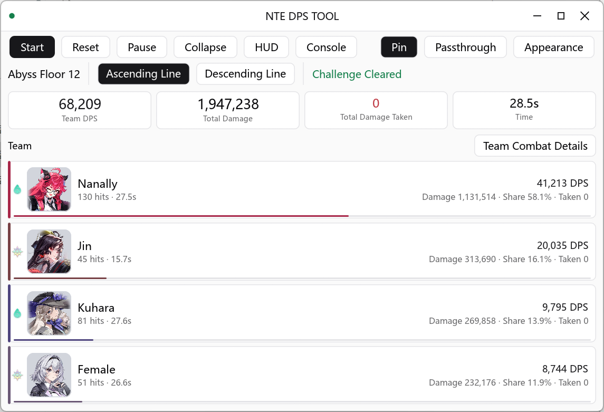
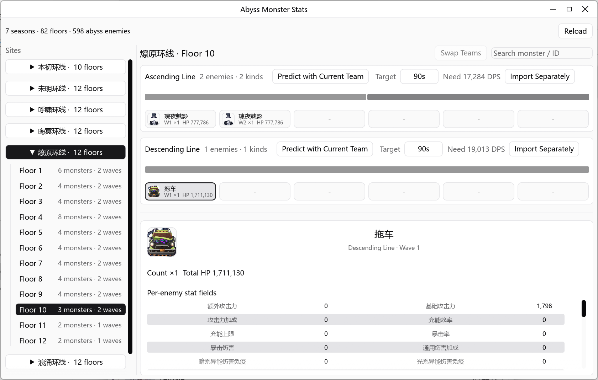
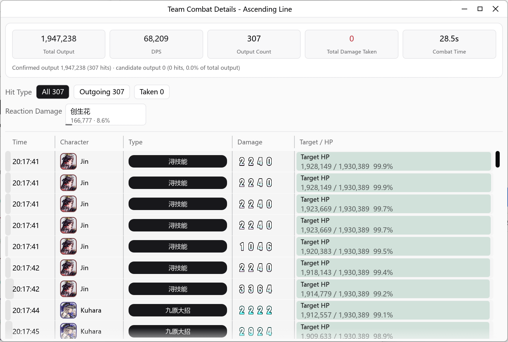
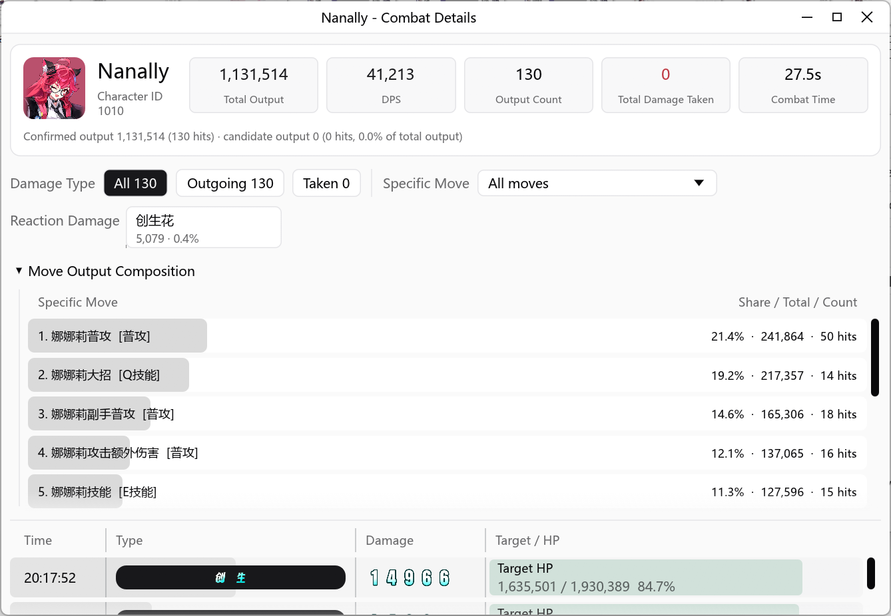
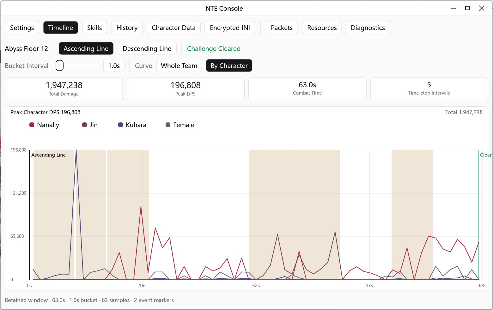
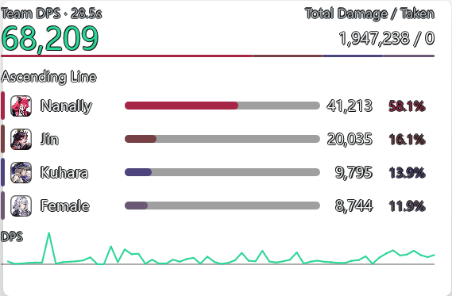

<div align="center">

<!-- LOGO / BANNER placeholder: replace with a project banner image -->


# NTE DPS Toolkit

**Real-time DPS damage analysis & combat diagnostics** · Built with Rust + egui, runs locally

[中文](README.md) | **English**

**[Official Site →](https://dps.o-na-ni.com/)**

<!-- Shields badges -->
[](LICENSE)
[](LICENSING.md)
[](#requirements)
[](https://www.rust-lang.org/)
[](https://github.com/emilk/egui)
[](https://npcap.com/)
[](https://github.com/kongbaiz/nte-dps-toolkit)

</div>

> **Keywords**: NTE DPS Toolkit · DPS Tool · DPS Analyzer · damage meter · real-time DPS analysis · combat diagnostics · packet capture · Npcap · egui

---

## Introduction

**NTE DPS Toolkit** is a local **DPS (damage-per-second) analysis and diagnostics tool** for NTE, built with **Rust + egui**. It runs entirely on the user's machine, reading relevant local UDP traffic via [Npcap](https://npcap.com/) to extract damage, abyss events, and selected GameplayEffect statistics, then displays an overview plus per-character, per-skill, hit-detail, and abyss up/down-line breakdowns in a local GUI.

As a **DPS Analyzer**, it targets players and researchers who want to review combat data, optimize rotations, and analyze team-composition performance — with real-time stats, historical comparison, and abyss prediction workflows.

> This is an independent community tool. It is **not affiliated with, authorized, endorsed by, or partnered with** the NTE publisher, developer, platform, or any related rights holders.

---

## Features

- **Real-time DPS stats**: live total damage, DPS, hit count, taken-damage, and combat duration.
- **Per-character analysis**: damage, share, hit count, DPS, taken-damage, skill categories, and filterable hit details per character.
- **Two timing modes**: "time-stop deducted" and "real time" DPS bases; ultimate animation time-stop uses resource-table durations, and extra time-stops are merged and deducted by parsed intervals.
- **Target HP fields preserved**: `target_hp_before`, `target_hp_after`, `target_max_hp`, `target_hp_percent`.
- **Skill & effect mapping**: parses and shows GameplayEffect mappings, skill categories, `ability_name`, `damage_name`, `attack_type`.
- **Abyss up/down-line stats**: tracked independently, preserving restart, line-entry, clear, and exit event states, with an abyss monster stat-table viewer.
- **Abyss prediction**: estimate clear time per up/down line, back-solve the DPS needed for a target time, and show static HP share per wave.
- **Console review panel**: combat timeline, skill share, parse quality, and a local history page; save de-identified combat summaries, view details, compare two records, and feed historical teams into abyss prediction.
- **Field-buff classification**: classifies optional supply-station field buffs like `GA_CardTrigger_*` / `GE_AbyssCard_*_Damage` as `Abyss Field Buff`, keeping them out of character skills or creation-flower damage.
- **Capture & replay**: saves full Ethernet frames live to `logs/nte_raw_*.pcapng`; export parsed JSON, save full PCAPNG, and import JSON / PCAPNG for debug replay.
- **Debug tooling**: inspect packet endpoints, character declarations, parse results, and payload previews; edit character data `res/data/characters/characters.json`; open/search/edit and save NTE encrypted INI; resource-coverage checks, an auto-diagnostics wizard, an adapter list, a server-damage calibration toggle, and more.
- **Customizable HUD**: choose display modules, max characters, and a mini DPS curve; defaults keep total DPS, time, total damage, and character ranking.
- **Auto persistence**: opacity, light/dark theme, always-on-top, and server-damage calibration saved to `%LOCALAPPDATA%\NTE DPS Tool\config.json`.
- **Hotkeys**: `Home` toggles click-through; debug builds use `F12` to toggle the Debug panel.
- **Auto adapter selection**: picks the network adapter and local IP from `HTGame.exe`'s active connections.

> Precise enemy-target and scene identification are still under research.

---

## Use Cases

- **Combat review**: record a fight's total damage, DPS curve, and hit details to find rotation bottlenecks.
- **Team evaluation**: compare per-character damage share and skill contribution to validate different compositions.
- **Abyss planning**: estimate clear time from historical team DPS and static monster HP, or back-solve the DPS needed to hit a target time.
- **Data research**: export JSON / PCAPNG for offline analysis, or import samples for reproducible parse replay and debugging.

---

## Requirements

- **OS**: Windows 10 / 11
- **Rust**: 1.85 or newer
- **Capture driver**: [Npcap](https://npcap.com/), preferably with *WinPcap API-compatible Mode* enabled
- **Privileges**: live capture may require running as Administrator

Normal use only needs Rust, Npcap, and the in-repo `res` assets. It does **not** need a client export tree, CUE4Parse, FModel, Python, the Npcap SDK, asset-export AES keys, or usmap. The Debug panel's encrypted-INI editor uses a stable INI-protocol key built into the code — no user-supplied export key required.

---

## Installation

```powershell
git clone https://github.com/kongbaiz/nte-dps-toolkit.git
cd nte-dps-toolkit
cargo test
cargo run --release
```

---

## Usage

1. Install [Npcap](https://npcap.com/) with *WinPcap API-compatible Mode* enabled.
2. Run the program as Administrator (usually required for live capture).
3. Launch the NTE client (`HTGame.exe`); the tool auto-selects the adapter and local IP from its active connections.
4. Start live capture in the main window; frames passing the current BPF filter are written to `logs/nte_raw_*.pcapng`.
5. View real-time stats in the Overview / Character / Abyss tabs; save or compare de-identified combat summaries in the Console history page.

Once capturing, the Debug panel can import a full PCAPNG or parsed JSON and run the same stable parse pipeline as live capture; after stopping, you can save the current full PCAPNG.

---

## Configuration

App settings are saved automatically to:

```text
%LOCALAPPDATA%\NTE DPS Tool\config.json
```

This covers opacity, light/dark theme, always-on-top, server-damage calibration, and more — restored on next launch without manual editing.

Resource directory layout:

```text
res/
  data/characters/   character configs
  data/skills/       GameplayEffect, skill, damage-name, and category mappings
  data/reactions/    reaction and reaction-image configs
  data/abyss/        abyss monster static tables, stat tables, and field display names
  images/characters/ character avatars
  images/attributes/ attribute icons
  images/font/        in-game damage-number font assets
  images/monsters/    abyss monster avatars
  images/reactions/   reaction text assets
  icons/              app icons
```

The program looks for `res` in the current directory or the executable's parent directory. Character, attribute, damage-number, reaction-text, and abyss-monster images are embedded at compile time as a fallback when external images are missing.

---

## Examples

### Screenshots

| Main window | Abyss stats |
|---|---|
|  |  |

| Team hit details | Character hit details |
|---|---|
|  |  |

| Combat timeline | Customizable HUD |
|---|---|
|  |  |

### Verifying a build

```powershell
cargo fmt --check
cargo check
cargo test
```

Diagnostics tests that depend on real captures are ignored by default. To run them, set `NTE_TEST_CAPTURE=<pcapng-path>` and run:

```powershell
cargo test -- --ignored
```

---

## FAQ

**Q: No traffic / no data is captured.**
A: Make sure Npcap is installed with *WinPcap API-compatible Mode* enabled, run as Administrator, and have `HTGame.exe` running. Debug builds include an auto-diagnostics wizard that checks the Npcap device, active connections, capture status, raw-packet writing, and damage-parse status step by step.

**Q: Do I need asset-export keys, usmap, or Python?**
A: No. Normal use only depends on the in-repo `res/` and the stable protocol key built into the code.

**Q: Do saved histories contain sensitive data?**
A: No. The Console "save this summary" action only writes de-identified statistics (results, character/skill summaries, abyss up/down-line summaries, parse-quality summaries). It does **not** include raw packets, payloads, decoded text, IPs, ports, local paths, or asset-authorization info.

**Q: How accurate is abyss prediction?**
A: It's based on static monster HP and the selected team's DPS, and does **not** account for invulnerability, phase transitions, movement, or mechanic time — treat it as a reference only.

**Q: Is this a cheat/hack?**
A: No. The tool only passively reads local network traffic for statistics. It does not inject, modify, or send anything to the game.

---

## Contributing

Issues and Pull Requests are welcome. Before submitting:

- Run `cargo fmt --check`, `cargo check`, and `cargo test` and make sure they pass.
- **Do not commit sensitive data**: `logs/`, `target/`, `data/`, local captures, full payloads, authorized-asset paths, asset-export keys, usmap, or full unpacked data must not be committed to the repo, issues, PRs, or public reports.
- Asset export, CUE4Parse probing, and `NTE_Assets` post-processing tooling live in a separate private repo, `kongbaiz/nte-resource-exporter`; when updating `res/`, sync only the necessary distributable asset files.
- The top-level `NTE_封包解析算法.md` is a de-identified maintenance summary documenting only the public design boundaries of the parser; finer samples, signatures, offsets, function names, and capture correlations should not be published with the public repo.

---

## License

This project is **dual-licensed** (see [LICENSING.md](LICENSING.md)):

- **Open source — [GNU AGPL v3.0](LICENSE)**: you are free to use, modify, and redistribute it, **including commercially**. But under the AGPL's **copyleft**: once you distribute the software, a modified version, **or let users interact with a modified version over a network (SaaS)**, you must release the **complete corresponding source code** under the AGPL. In short — you *can* use it commercially, but you *cannot* build a closed-source product or service on top of it.
- **Commercial license**: to use it in ways the AGPL does not permit (e.g. inside a **closed-source** product, or a proprietary hosted service without source disclosure), obtain a separate commercial license from the copyright holder — open an issue with the `commercial-license` label; see [LICENSING.md](LICENSING.md) for contact details.

Third-party libraries, runtime components, and asset files retain their own licenses and rights notices — see [THIRD_PARTY_LICENSES.md](THIRD_PARTY_LICENSES.md) and [NOTICE.md](NOTICE.md).

---

<div align="center">
<sub>NTE DPS Toolkit · DPS Analyzer & combat diagnostics · Community-maintained, not affiliated with NTE</sub>
</div>
