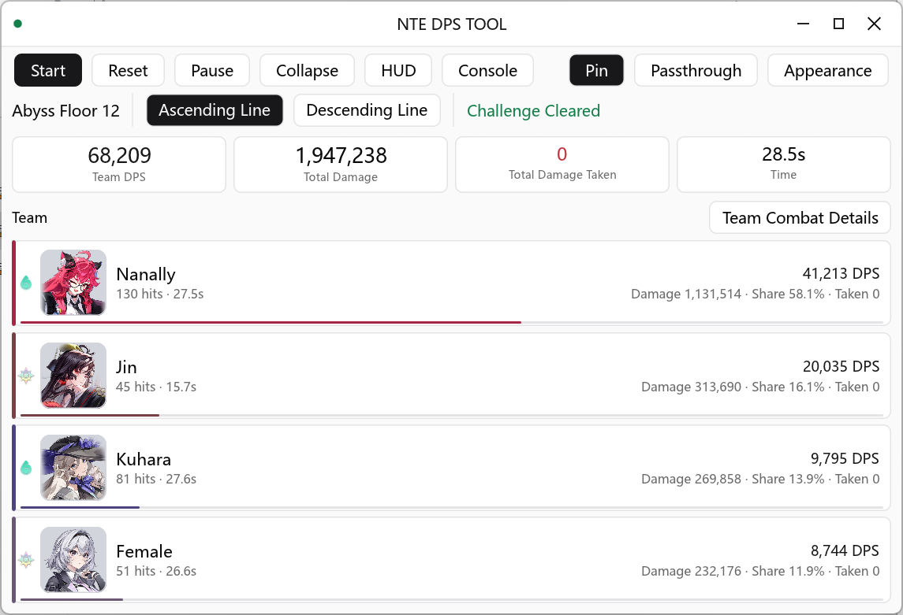
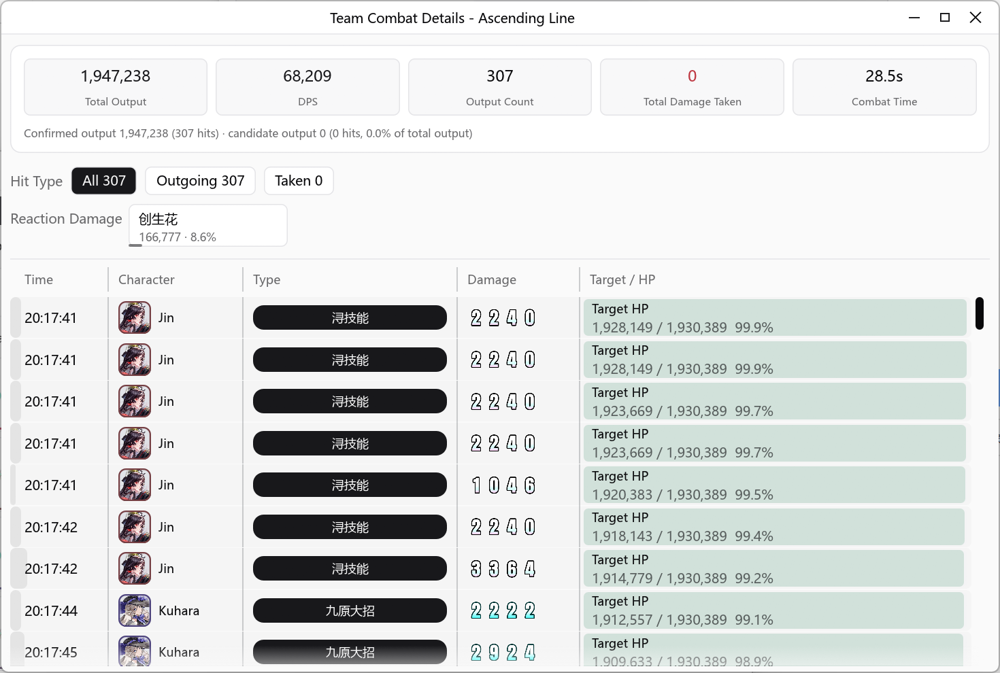
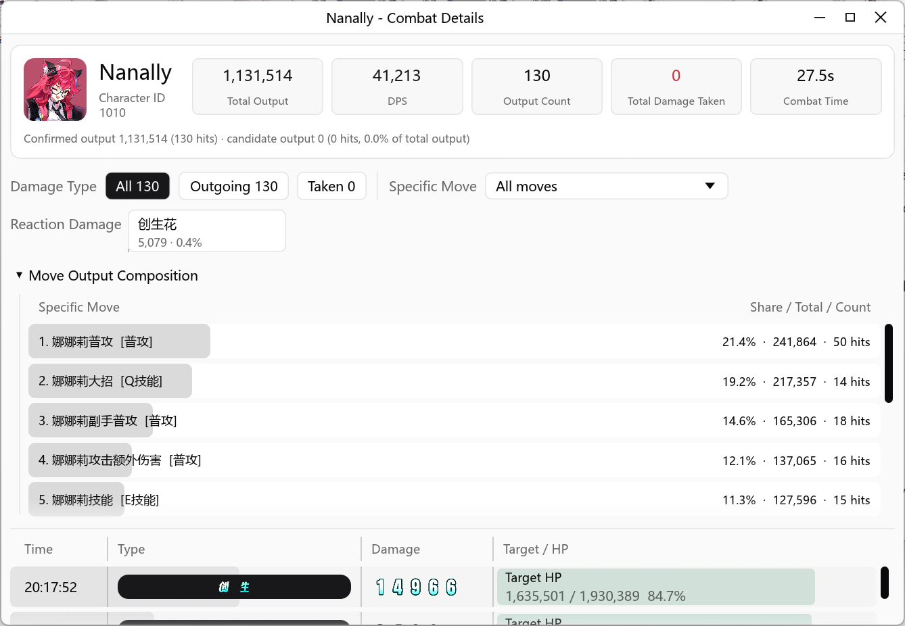
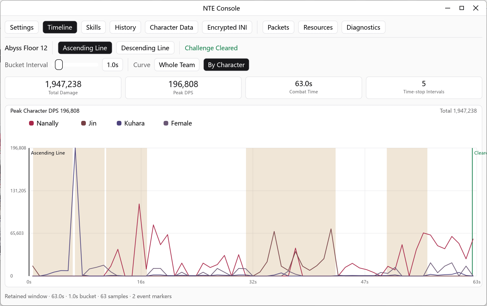
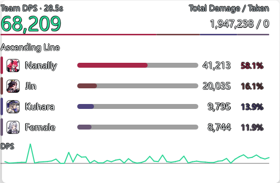
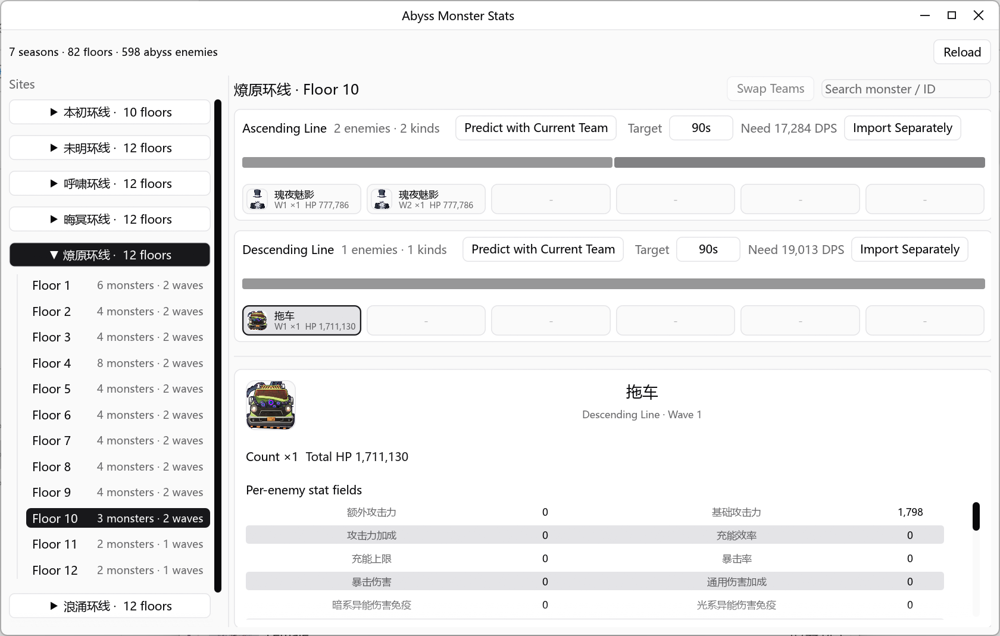

<div align="center">


# NTE DPS Toolkit

**Local real-time DPS and combat analysis for Neverness to Everness (NTE)**

[中文](README.md) | **English**

[](https://github.com/kongbaiz/nte-dps-toolkit/releases/latest)
[](#quick-start)
[](LICENSE)
[](LICENSING.md)
[](https://github.com/kongbaiz/nte-dps-toolkit)

[**Download for Windows**](https://github.com/kongbaiz/nte-dps-toolkit/releases/latest) · [**Official site**](https://dps.o-na-ni.com/) · [**Video demo**](https://www.bilibili.com/video/BV1YRNP6SEG5/)

</div>

<p align="center">
  
</p>

NTE DPS Toolkit records and explains **where your damage came from, where a rotation lost output, and why two teams performed differently**. It provides live character and skill statistics, local combat history, run-to-run comparison, and Abyss clear-time planning.

- **Local-first**: combat data stays on your computer by default. No account is required and nothing is uploaded automatically.
- **Lightweight**: the current desktop app was rebuilt from egui to Tauri + React. In the developer's test environment it idles at roughly **50 MB RAM**, about one sixth of the previous version. Actual usage varies by system, WebView version, and enabled features.
- **Built for real combat analysis**: total DPS is only the starting point; the app also provides character, skill, hit-detail, timeline, history, and Abyss workflows.
- **Open and auditable**: capture, parsing, desktop UI, and the local Sidecar are available in this repository.

> This is an independent community project. It is not affiliated with, authorized, endorsed by, or partnered with the NTE publisher, developer, platform, or any related rights holder.

---

## What it helps you answer

| Use case | Result |
|---|---|
| **Combat review** | Total damage, effective DPS, combat duration, DPS curve, and individual hit details |
| **Character and skill analysis** | Character share, skill categories, GameplayEffect mappings, and filterable details |
| **Rotation comparison** | Save two de-identified summaries and compare team, character, skill, and timing differences |
| **Abyss planning** | Track upper/lower routes independently, estimate clear time, and back-solve required DPS |
| **Diagnostics and research** | Import or export JSON / PCAPNG to reproduce parser issues and inspect data quality |

---

## Quick start

### 1. Install Npcap

Install [Npcap](https://npcap.com/). Enabling **WinPcap API-compatible Mode** is recommended.

### 2. Download the player build

Open the [latest Release](https://github.com/kongbaiz/nte-dps-toolkit/releases/latest) and download:

```text
nte-dps-tool-windows-x64.zip
```

Extract it to a writable directory and run:

```text
nte-dps-tool.exe
```

> **Players should not download `nte-core-windows-x64.zip`.** `nte-core.exe` has no graphical interface. It is a stdio Sidecar for third-party integrations, so exiting immediately when double-clicked is expected.

### 3. Start recording

1. Run the tool as Administrator; live capture usually requires elevated permissions.
2. Launch the NTE client (`HTGame.exe`).
3. Click Start Capture. The app will try to select the active adapter and local IP automatically.
4. Review live data and saved runs in Overview, Character, Abyss, and Console.

When no data appears, open **F12 → Diagnostics** and run the automatic diagnostics wizard.

---

## Which download should I use?

| File | Intended user | Contents |
|---|---|---|
| `nte-dps-tool-windows-x64.zip` | **Most players — recommended** | Standard Tauri desktop app, embedded resources, full diagnostics, and optional plugin files |
| `nte-dps-tool-windows-external-resources.zip` | Advanced users who need editable resources | Full desktop app with an external `res/` directory |
| `nte-core-windows-x64.zip` | Third-party tool developers | Headless JSON-RPC 2.0 / NDJSON Sidecar |

---

## Operating modes and security boundaries

### Packet-only mode

The default workflow uses Npcap to **passively read relevant local UDP traffic**:

- it does not send data to the game;
- it does not modify game data;
- it does not require asset-export keys, usmap, FModel, CUE4Parse, or Python;
- captures, logs, and history remain in the application directory.

Packet-only mode supports the main live DPS, character/skill, history, Abyss, and JSON/PCAPNG replay workflows.

### Optional native plugin mode

Some advanced features — including authoritative pause-state timing for precise time-stop deduction — require the optional native plugin. This mode:

- is disabled by default and requires explicit confirmation in **Console → Mod Workshop**;
- installs the provided `dwmapi.dll` beside `HTGame.exe` for the selected client;
- uses restricted scripts, read-only memory access, event subscriptions, and an explicit capability allowlist;
- has a different technical and risk boundary from packet-only capture. Read the in-app disclosure and [`native/nte-mods-plugin/README.md`](native/nte-mods-plugin/README.md) before enabling it.

Close the game before changing plugin installation state. If another `dwmapi.dll` already exists in the target directory, the tool preserves it and reports a conflict instead of overwriting or deleting another mod.

---

## Core features

### Live statistics and HUD

- Total damage, DPS, hit count, damage taken, and combat duration;
- character rankings, damage share, skill categories, and filterable hit details;
- configurable HUD modules, opacity, theme, always-on-top, click-through, and mini DPS curve;
- `Home` toggles click-through and `F12` opens or closes Console.

### Timing and damage accounting

- Real-time and time-stop-deducted DPS bases;
- authoritative pause timing through the optional native plugin;
- preserved `target_hp_before`, `target_hp_after`, `target_max_hp`, and `target_hp_percent` fields;
- GameplayEffect, `ability_name`, `damage_name`, `attack_type`, and skill-category mappings;
- separate classification for Abyss field buffs and other special damage sources.

### History, replay, and diagnostics

- Save de-identified combat summaries, inspect details, and compare two runs;
- combat timeline, skill share, parser-quality information, and local history;
- live Ethernet-frame capture to `logs/nte_raw_*.pcapng`;
- parsed JSON export, full PCAPNG save, and reproducible JSON / PCAPNG replay;
- automatic checks for adapters, Npcap, active connections, capture state, raw packet writing, and damage parsing.

### Abyss analysis

- Independent upper-route and lower-route tracking;
- restart, route-entry, clear, and exit event states;
- estimated clear time from historical team DPS;
- required-DPS calculation for a target time and static HP share by wave.

> Abyss estimates use static monster HP and historical DPS. They do not model invulnerability, phase transitions, movement, or mechanic downtime.

---

## Screenshots

| Team hit details | Character hit details |
|---|---|
|  |  |

| Combat timeline | Configurable HUD |
|---|---|
|  |  |

| Abyss analysis |
|---|
|  |

---

## Data and configuration

Configuration, logs, and history are stored beside the executable:

```text
<application directory>/
├─ config.json        UI and runtime settings
├─ history/           De-identified combat history
└─ logs/              PCAPNG captures and runtime logs
```

The legacy `%LOCALAPPDATA%\NTE DPS Tool\config.json` is migrated on first launch; the original file is left untouched.

“Save current summary” stores de-identified statistics only. It does not include raw packets, payloads, decoded text, IP addresses, ports, local paths, or asset-authorization information. Raw PCAPNG files are generated locally; review them before attaching them to a public Issue.

---

## Third-party integration: `nte-core.exe`

`nte-core.exe` is a headless local Sidecar using **JSON-RPC 2.0 over NDJSON**:

- requests arrive on stdin;
- responses and events are written to stdout;
- logs are written to stderr;
- it does not listen on or open a network port;
- the CLI package contains no desktop UI images, fonts, icons, or window dependencies.

Documentation and examples:

- [English protocol](docs/CLI_PROTOCOL.md)
- [中文协议文档](docs/CLI_PROTOCOL_ZH.md)
- [Python standard-library client](docs/examples/nte_core_client.py)

Build the CLI:

```powershell
cargo build --release --bin nte-core --no-default-features --features cli
```

---

## Build from source

### Requirements

- Windows 10 / 11
- Rust 1.85+
- Node.js 24
- pnpm 10
- Npcap

### Run the desktop app

```powershell
git clone https://github.com/kongbaiz/nte-dps-toolkit.git
cd nte-dps-toolkit
corepack enable
pnpm --dir frontend install --frozen-lockfile
cargo test
pnpm --dir frontend tauri:dev
```

### Verification

```powershell
cargo fmt --check
cargo check
cargo test
cargo fmt --check --manifest-path src-tauri/Cargo.toml
cargo check --manifest-path src-tauri/Cargo.toml
cargo test --manifest-path src-tauri/Cargo.toml
cargo check --bin nte-core --no-default-features --features cli
cargo test --no-default-features --features cli
pnpm --dir frontend lint
pnpm --dir frontend typecheck
pnpm --dir frontend test
pwsh -NoProfile -File scripts/verify_architecture.ps1
```

The final command verifies that Tauri is the only desktop UI and keeps the CLI dependency tree isolated from desktop window dependencies.

Capture-dependent diagnostic tests are ignored by default. Set `NTE_TEST_CAPTURE=<pcapng-path>` and run:

```powershell
cargo test -- --ignored
```

---

## FAQ

### No traffic or damage data appears

Confirm that Npcap is installed with *WinPcap API-compatible Mode*, run the tool as Administrator, and start `HTGame.exe`. Then run the wizard under **F12 → Diagnostics**.

### Why does `nte-core.exe` exit immediately?

It is a command-line Sidecar for third-party software and has no standalone GUI. Players should run `nte-dps-tool.exe`.

### Is the native plugin required?

No. Packet-only mode supports the main statistics, history, Abyss, and replay workflows. Precise pause-state timing and selected research features require the optional plugin.

### Is this a cheat?

Packet-only mode passively reads local network traffic and does not inject, modify, or send data to the game. The optional native plugin installs a DLL and uses restricted event and memory capabilities, so it has a separate technical and risk boundary. Using it is the user's decision.

### Why does an Abyss estimate differ from the actual clear time?

The estimate does not include invulnerability, phase transitions, movement, or mechanic downtime. It is intended for planning and comparison.

---

## Known boundaries

Precise enemy-target and scene identification remain under research. `plugins/nte-mods/enemy-telemetry.nte` projects localized enemy names and portraits into combat details only when both the configuration catalog and captured HP continuity match. When no reliable match is available, rely on the raw statistics and parser-quality indicators.

---

## Contributing

Issues and pull requests are welcome. Before submitting:

- run formatting, compilation, and test checks;
- do not commit `logs/`, `target/`, `data/`, local captures, full payloads, authorized asset paths, export keys, usmap, or full unpacked data;
- asset-export and post-processing toolchains are not published here; only necessary redistributable resources should be synchronized;
- `NTE_封包解析算法.md` documents only the de-identified public design boundary.

---

## License

This project uses [dual licensing](LICENSING.md):

- **Open-source license — [GNU AGPL v3.0](LICENSE)**: use, modification, redistribution, and commercial use are allowed; distributing a modified version or offering it over a network requires providing the complete corresponding source under the AGPL.
- **Commercial license**: a separate commercial license is required for closed-source integration or other uses not permitted by the AGPL.

Third-party libraries, runtime components, and resources retain their own licenses and rights. See [THIRD_PARTY_LICENSES.md](THIRD_PARTY_LICENSES.md) and [NOTICE.md](NOTICE.md).

---

<div align="center">
<sub>NTE DPS Toolkit · Local DPS analyzer and combat diagnostics · Community-maintained and unaffiliated with NTE</sub>
</div>
