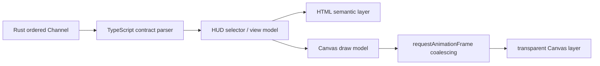

# Tauri HUD 等价迁移规划

## 1. 目标与当前边界

目标是把现有 egui 战斗 HUD 等价迁移到 Tauri + React，同时保持 Rust 为战斗状态、
配置、窗口状态和历史规则的唯一事实源。

当前只迁移 `hud-spike` 一个窗口。egui HUD 继续作为行为与视觉基线，直到透明、拖动、
穿透恢复、置顶、多 DPI、多显示器和高负载全部通过人工验收。

透明、圆角、持久模糊、失焦和拖动合成基线已在 2026-07-30 由用户确认“目前没问题”。
当前已完成阶段 D 和最终宿主集成实现，并补齐 `hud-spike` 的原生水平缩放、穿透恢复与
窗口位置生命周期：

- Rust 在 `HudSnapshot` v2 中继续输出现有模块顺序与显隐配置；
- frontend-neutral `LiveCaptureService` 复用现有 capture controller 和 reducer；
- 技术契约 v4 在原有有序 Channel 中批量传输抓包生命周期与完整 HUD 快照；
- React 边界运行时校验后，以 HTML 复刻团队摘要、占比条和四名角色行；
- 原生 Canvas 2D 绘制时间线折线，HTML overlay 提供峰值、时间区间和数值 Tooltip；
- 编辑态 HTML 面板按 Rust 顺序列出模块，并通过 typed command 提交显隐和单次移动意图；
- Rust 复用 `HudConfig::set_module_visible` 与 `HudConfig::move_module`，完整配置保存成功后
  才更新投影代次；
- 宽度输入只在 Enter 或失焦时提交一次 typed command；Rust 使用既有配置范围校正，
  保存成功后同步原生窗口逻辑宽度并保留当前高度；
- 原生窗口高度随模块显隐和穿透状态变化，并通过相同的逻辑 min/max 高度锁定；用户只
  调整宽度，和原版 HUD 的水平缩放语义一致；
- Rust 窗口层监听原生 resize，把物理像素按当前 DPI 换算为逻辑宽度；连续拖动结束
  350 ms 后只保存最后一个宽度，避免逐像素写配置；
- 原生拖动宽度与输入框宽度共用 `AppState::set_hud_width` 原子事务，配置保存成功后
  才递增投影代次；重启继续使用最后一次成功保存的逻辑宽度；
- 置顶按钮先应用原生窗口状态，再通过 Rust 保存完整 `UiConfig`；保存失败时恢复此前
  原生状态，成功后才发布新的窗口投影；并发置顶意图通过窗口事务锁顺序执行；
- Tauri 复用根配置的鼠标穿透快捷键（默认 Home），Windows 低级键盘钩子只发布轻量
  toggle 事件；游戏在前台或 HUD 已穿透时仍可直接恢复编辑，不创建额外窗口；
- 原生移动事件在 350 ms 静默期后只保存最后一个物理虚拟桌面坐标；重启时保留仍可达
  的负坐标/副屏位置，显示器缺失时回退到主显示器工作区中心；
- 编辑栏提供 typed 抓包启停意图，并显示稳定状态 key/错误码；
- Rust `HudConfig` 决定初始原生窗口宽度、模块顺序和显隐；React 内容跟随实际
  WebView viewport 填充，确保视觉边框与原生缩放边界一致；
- 非穿透态使用 Windows 持久 Acrylic accent policy 与 HTML 半透明层组合；该原生效果
  不随焦点变化，也不在窗口拖动时重复设置，穿透态同时清除两层效果；
- 编辑态内容层直接贴合 viewport，不保留会透出原生 Acrylic 底色的外边距；圆角使用
  内容层裁切，不绘制描边；
- Windows 平台层同时对原生 HWND 设置 DWM 圆角并关闭系统边框，使 Acrylic 合成面与
  HTML 裁切边界一致；
- HUD 根节点默认禁止文本选择；只有显式标记 `data-hud-selectable-text` 的日志、代码或
  诊断区域恢复文本选择。
- 阶段 D 的配置实现及基础人工验收已完成；最终宿主集成代码已收口，仍需完成下述
  多屏、拔插、游戏前台和穿透恢复专项人工门槛。

## 2. 等价功能清单

后续只读 HUD 契约需要覆盖以下现有行为，字段名以实际 Rust DTO 评审结果为准：

| 模块       | Rust 权威数据                                     | React 展示职责                         |
| ---------- | ------------------------------------------------- | -------------------------------------- |
| 流元数据   | `generation`、`sequence`、快照/增量类型、采样时刻 | 按序消费、丢弃旧代次、显示 stale/error |
| 标题       | 当前轮次或预览状态、稳定显示 key                  | 排版、halo、截断                       |
| 团队摘要   | 团队 DPS、持续时间、总伤害、承伤、扣时            | 数值格式、显隐和响应式布局             |
| 状态行     | 深渊上下半场、暂停/穿透等稳定状态枚举             | i18n、颜色和图标                       |
| 角色行     | 稳定角色 ID、名称投影、伤害、DPS、占比、排序结果  | 行布局、占比条、空值展示               |
| 迷你时间线 | Rust 聚合或降采样后的有序 bucket                  | Canvas 曲线/面积、HTML 标签和提示      |
| HUD 配置   | 宽度、模块顺序、模块显隐、编辑状态                | 编辑交互投影，不复制默认值             |
| 窗口状态   | 置顶、穿透和恢复结果                              | 发出 typed intent、展示确认状态        |

跨 JS 边界的 64 位计数、ID 和累计值使用十进制字符串或经验证的安全表示。React
不得接收 `CombatState`、逐 hit、逐包或内部 Rust enum。

## 3. HTML-in-Canvas 混合组件

### 3.1 落地形态

本项目把 **HTML-in-Canvas** 定义为同一个 React 组件容器中的两层协作：

```text
HybridHudComponent
├─ canvas（曲线、面积、密集刻度或高频视觉层）
└─ HTML overlay（文本、按钮、Tooltip、焦点和无障碍语义）
```

Canvas 和 HTML 使用同一个经过验证的 view model。Canvas 不独立订阅 Tauri Channel，
HTML 也不反向读取 Canvas 像素来恢复业务状态。默认不把任意 HTML 栅格化后绘入
Canvas；这样可保留清晰字体、i18n、选择/焦点、Tooltip 和辅助技术语义。

### 3.2 组件分配

| 组件                          | 首选渲染                         | 原因                                   |
| ----------------------------- | -------------------------------- | -------------------------------------- |
| 团队 DPS、持续时间和总伤害    | HTML                             | 文本清晰、i18n 和可访问性优先          |
| 角色名称、数值和模块编辑手柄  | HTML                             | 需要焦点、拖放、右键菜单和稳定命中区域 |
| 角色占比条                    | HTML/CSS；测量后可改 Canvas 底层 | 当前密度低，不先引入绘图复杂度         |
| 迷你时间线                    | Canvas 曲线 + HTML 标签/Tooltip  | 连续折线和高 DPI 缩放更适合绘图层      |
| 密集 sparkline 或短时峰值标记 | Canvas + HTML 可访问摘要         | 高频几何可合并为一次绘制               |
| loading、empty、error         | HTML                             | 必须可读、可聚焦并走统一 i18n          |
| HUD 背景                      | 编辑态 HTML 模糊背板             | 穿透展示模式保持无背板透明             |

### 3.3 数据与渲染生命周期



- Rust 在同一批次内先归并状态，再发布一个带 `generation/sequence` 的更新；
- React selector 生成稳定引用，DOM 与 Canvas 消费同一版本；
- Canvas 只在数据、尺寸、主题或 DPI 改变时标记 dirty，并在下一帧合并绘制；
- 组件卸载时取消 `requestAnimationFrame`、`ResizeObserver` 和事件监听；
- 后台或不可见窗口停止主动重绘；重新可见时用最新完整 view model 重画；
- Canvas 使用 alpha 上下文和 `clearRect`，不得填充整个 WebView 矩形底色。
- 原生 Acrylic 只属于非穿透编辑态；切换穿透时通过窗口适配层清除，React 不直接调用
  原生窗口效果。

### 3.4 DPI、命中与可访问性

- CSS 尺寸使用逻辑像素，backing store 按实时 `devicePixelRatio` 重建；
- 100%、125%、150% DPI 和跨显示器移动后都要重新测量并绘制；
- 展示模式下 Canvas 默认 `pointer-events: none`；
- 编辑模式的拖动手柄、菜单和 Tooltip 由 HTML overlay 接收输入；
- Canvas 图形提供相邻 HTML 摘要或可访问名称，不把颜色作为唯一信息；
- 用户可见文本继续使用英文稳定 key 与 `res/languages/zh-CN.json`，不在绘图代码中
  维护第二套翻译。

### 3.5 性能与依赖策略

- 先使用原生 Canvas 2D，不新增绘图库；
- 先测量典型 380px HUD、4 个角色行和迷你时间线的绘制耗时、内存与重绘频率；
- 只有测量证明主线程绘图成为瓶颈后，才评估 OffscreenCanvas、worker 或专用库；
- 不做逐 hit、逐动画帧 Tauri IPC；Canvas 只消费聚合 bucket；
- 自动化优先测试 scale、裁切、bucket 映射和 draw model 等纯函数，不依赖脆弱的像素
  快照作为唯一回归证据。

## 4. 分阶段实施

### 阶段 A：透明壳基线（已通过本轮基础人工确认）

1. 无背板文字验证；
2. 独立拖动区显式调用 `startDragging()`；
3. 置顶和穿透 typed intent 保持可测；
4. 完成人工透明、拖动、DPI 和多显示器验收。

本轮确认覆盖当前透明与拖动表现；最终替换前仍需完成跨 DPI、多显示器、游戏高负载、
休眠恢复和显示器拔插专项。

### 阶段 B：只读 HUD 契约（自动化实现完成，实战对照仍属替换门槛）

1. [x] 从现有 Rust HUD 事实源提取 frontend-neutral DTO；
2. [x] 在完整有序 Channel 快照中加入 HUD 投影；
3. [x] TypeScript 边界运行时校验；
4. [x] 用 HTML 建立团队摘要、占比条和角色行的第一版布局；
5. [x] 覆盖投影、版本、未知枚举、顺序拒旧和订阅清理测试；
6. [x] 用现有 capture controller + reducer 向共享 `CombatState` 提供实时事件；
7. [x] 加载角色/技能资源，并把抓包启停、状态和稳定错误接入 typed contract；
8. [ ] 完成实战数据、当前语言角色名称和异常恢复等价验证。

当前 Tauri 进程在用户点击编辑栏播放按钮后启动抓包；启动前编辑态仍展示 Rust
生成的同口径预览，穿透态无数据时展示 empty。抓包事件只进入现有 reducer，
Channel 每 100 ms 只检查轻量状态代次；仅在抓包或窗口状态变化时生成并批量发布聚合
投影，空闲时跳过完整投影、序列化和 IPC。详细边界见
`docs/TAURI_MIGRATION_PHASE2.md`。

### 阶段 C：HTML-in-Canvas 迷你时间线（基础人工确认通过）

1. [x] Rust 输出最多 60 个降采样 bucket；
2. [x] 建立纯 draw model 和 Canvas 绘制 hook；
3. [x] HTML overlay 提供时间、峰值和 Tooltip；
4. [ ] 人工验证透明合成、DPI、resize 和高负载；
5. [ ] 与 egui 迷你时间线逐项对照。

用户已确认当前时间线与低延迟刷新表现无明显问题；跨 DPI、多显示器和游戏高负载仍保留
在最终替换门槛。

### 阶段 D：局部编辑模式与配置（当前）

1. [x] HTML 模块面板与隐藏模块恢复入口；
2. [x] 模块显隐通过 typed command 交给 Rust 校验和保存；
3. [x] 保存成功后发布新一代快照，失败保留上一配置；
4. [x] 显隐变化后由 Rust/Tauri 同步原生内容高度；
5. [x] HTML Pointer Capture 拖拽手柄、目标位置提示、键盘上下移动与模块排序；
6. [x] HUD 宽度编辑、范围校正、持久化与原生窗口同步；
7. [x] 原生窗口高度锁定为 Rust 内容高度，只保留水平宽度调整；
8. [x] 原生左右边缘缩放按 DPI 换算逻辑宽度，并在停止拖动后防抖持久化；
9. [x] 完成显隐面板、重启恢复、窄窗口和 DPI 人工验证。

用户已在 2026-07-31 确认阶段 D 现有交互、水平缩放持久化和多 DPI 检查均无明显问题。

### 阶段 D 补充：窗口偏好与恢复生命周期（实现完成）

1. [x] 置顶按钮复用根 `UiConfig.always_on_top`，保存成功后更新投影代次；
2. [x] 保存失败时保留旧 Rust 投影，并尝试恢复此前的原生置顶状态；
3. [x] 同值重复设置跳过配置写入和 Channel 推送；
4. [x] 并发置顶意图顺序执行，避免原生窗口层级与最终配置交叉覆盖；
5. [ ] 完成置顶开关双向重启恢复与游戏前台组合人工验证。
6. [x] 复用根配置的穿透快捷键，默认 Home，在游戏前台直接切换穿透/编辑；
7. [x] 热键钩子就绪前保持 HUD 可编辑，钩子故障时恢复编辑；不注册全局 F12；
8. [x] 原生窗口位置以物理虚拟桌面坐标防抖持久化；
9. [x] 启动时校验标题栏可达性，显示器缺失时居中回退到主工作区；
10. [ ] 完成穿透恢复、多显示器混合 DPI、休眠和显示器拔插人工验证。

### 阶段 E：替换门槛

只有以下项目全部通过后，才讨论移除 egui HUD 入口：

- 无矩形底色、白边、黑底或不均匀色块；
- 拖动、快速缩放、穿透恢复和置顶正确；
- 团队摘要、角色行、状态行、深渊半场和时间线等价；
- 中英文长文案、窄窗口、100%/125%/150% DPI 正确；
- 多显示器、休眠恢复、显示器拔插和游戏高负载稳定；
- loading、empty、error、stale 和 Channel 重连行为明确。

## 5. 当前人工验收清单

运行：

```powershell
pnpm --dir frontend tauri:dev
```

只验收 `hud-spike`：

1. 启动前确认编辑态预览和“当前无实时抓包任务”，点击播放按钮后状态依次变为
   “正在启动实时抓包…”和“实时抓包任务正在运行”；
2. 实战造成伤害后，确认最多 100 ms 合并窗口内预览被真实团队 DPS、时长、总伤害、占比条和
   角色行替换；
3. 点击停止按钮，确认状态依次变为“正在停止实时抓包…”和“已停止”，已有读数保留；
4. 分别覆盖游戏未启动、Npcap/网卡异常，确认显示稳定、可本地化的具体原因，并可重试；
5. 非穿透编辑态确认半透明模糊背板在亮色背景上保持可读；开启穿透后背板和编辑控件同时
   消失，无战斗数据时展示本地化 empty，抓包异常仍可见；
6. 拖动原生窗口左右边缘确认只调整宽度；拖动顶部、底部和四角时高度保持 Rust
   内容高度，视觉背板边框始终贴合实际边界；
7. 把窗口放在纯色桌面和游戏无边框窗口上，确认穿透态内容之外仍完全透明；
8. 拖动顶部带手柄的文字行，确认窗口跟随且刷新、抓包和开关不会触发拖动；
9. Channel 连续刷新时数值和排序不闪烁；
10. 在窄窗口、100%、125%、150% DPI 及不同缩放显示器之间检查裁切和数值列；
11. 关闭 egui 程序后单独运行 Tauri HUD，再分别运行同类战斗进行对照，避免两个独立
    HUD 窗口在系统截图中同时合成。
12. 先在现有设置中启用“迷你时间线”（或选择详细 HUD 预设），再关闭 egui 并启动
    Tauri；确认预览和实战时间线都出现；
13. 非穿透态在时间线上移动鼠标，确认 HTML Tooltip 显示 bucket 时间、DPS 和伤害；
    开启穿透后时间线不接收鼠标；
14. 调整窗口宽度并在 100%、125%、150% DPI 显示器间移动，确认折线清晰、无拉伸残影，
    峰值与 Tooltip 位置仍在组件边界内。
15. 非穿透态打开“HUD 模块”，逐项隐藏并恢复标题、汇总、状态、角色排行和曲线；
16. 关闭并重新启动 Tauri HUD，确认模块显隐配置保持；
17. 隐藏大部分模块后确认窗口高度收缩，同时模块面板仍可打开并恢复所有模块。
18. 拖动每行左侧手柄到目标行上半区和下半区，确认分别插入目标前后；
19. 聚焦拖拽手柄并按上下方向键，确认模块按相同 Rust 语义移动；
20. 关闭并重启 Tauri HUD，确认模块顺序保持，HUD 实际渲染顺序与面板一致。
21. 在“HUD 宽度”中分别输入 280、380、512，按 Enter 或点击输入框外，确认一次提交后
    原生窗口宽度与返回值一致，当前高度保持不变；
22. 输入小于 280 和大于 3840 的整数，确认 Rust 分别校正为 280 和 3840；输入空值、
    小数或按 Escape，确认恢复当前权威宽度；
23. 关闭并重启 Tauri HUD，确认宽度保持；在全部模块关闭时打开模块面板，确认宽度输入
    仍完整可见；
24. 调整宽度后检查 HTML 排版和 Canvas 时间线重绘，并在 100%、125%、150% DPI 下确认
    逻辑宽度、清晰度和命中区域一致。
25. 依次切换模块显隐和鼠标穿透，确认 Rust 更新内容高度后新的高度继续锁定；随后拖动
    上下边缘和四角，高度不产生临时变化或回弹。
26. 从左右边缘连续快速调整宽度，停止约 350 ms 后关闭并重新启动 Tauri HUD，确认恢复
    到最后一次拖动宽度而非拖动过程中的中间值；
27. 原生拖动完成后保持模块面板打开，确认“HUD 宽度”输入框随新一代快照更新；随后在
    输入框提交另一宽度，确认两条入口保持同一权威值；
28. 在 100%、125%、150% DPI 以及不同缩放显示器之间分别调整宽度并重启，确认保存和
    恢复的是逻辑宽度，未产生按缩放比例放大或缩小的偏差。
29. 关闭置顶后重启 Tauri HUD，确认按钮与原生窗口都保持关闭；重新开启并再次重启，
    确认按钮与原生窗口都保持开启；
30. 在游戏无边框窗口前分别切换置顶开关，确认即时原生层级和重启后的配置一致，重复
    点击同一状态时不产生按钮闪烁或额外快照。
31. 在编辑态按 Home，确认 HUD 直接开启穿透且没有新窗口；保持游戏前台再次按 Home，
    确认 HUD 恢复输入、编辑效果和正确高度。
32. 长按 Home 确认只切换一次；依次验证 Ctrl+Home、Alt+Home、Shift+Home 不触发，
    松开后再次按 Home 才执行下一次切换。
33. 分别在主屏、副屏负坐标和 100%/125%/150% 混合 DPI 下移动 HUD，等待至少
    350 ms 后重启，确认恢复到最后一次移动位置。
34. 把 HUD 留在副屏后断开该显示器并重启，确认窗口居中回退到主显示器工作区；重新连接
    后再次移动和重启，确认新坐标成为权威位置。
