# Tauri migration phase 2: live read-only HUD projection

## Scope

This phase continues only the `hud-spike` window after the transparent shell and
explicit dragging baseline was accepted. It connects the first product-facing
HUD projection to the existing live capture/reducer path while leaving the egui
HUD intact.

Implemented in this slice:

- UI-neutral Rust `HudSnapshot` v1 projected from `CombatState`;
- Rust-owned preview and empty states;
- `HudConfig` width, module order, and visibility projected as explicit DTOs;
- aggregate team summary, up to four sorted character rows, damage share, and
  abyss status fields;
- frontend-neutral `LiveCaptureService` owning one `CaptureController`, one
  authoritative `CombatState`, and one background reducer event worker;
- existing `CaptureProfile::Combat` startup with configured NIC selection,
  incoming damage calibration, local raw PCAPNG diagnostics, and
  `PacketEmissionMode::SummaryOnly`;
- technical contract v3 carrying capture lifecycle plus one complete HUD
  projection per ordered Channel snapshot;
- typed start/stop commands that return immediately while Npcap setup and stop
  work stay off the Tauri main thread;
- stable capture phase, message key, and issue code projection without internal
  error details or local raw-capture paths;
- TypeScript runtime validation at the IPC boundary;
- HTML summary and character rows with a blurred edit-mode surface that is
  removed completely in passthrough mode;
- a persistent Windows Acrylic accent policy in edit mode so the desktop/game
  content behind the transparent WebView participates in the blur without
  deactivating on focus loss;
- a viewport-filling React surface so its visible border follows the actual
  native resize bounds instead of staying at the configured initial width;
- no outer CSS margin or shadow that would expose an opaque-looking native Acrylic
  frame; the HTML tint stays at 40% opacity and uses clipped rounded corners
  without a visible stroke;
- native DWM corner preference and border suppression applied to the HWND after
  Acrylic setup and passthrough transitions, so the compositor surface itself
  no longer remains rectangular behind the rounded HTML layer;
- Acrylic is applied only during setup and passthrough transitions instead of
  focus or drag events, preventing transparent/opaque composition flashes;
- the HUD root is non-selectable by default; future log, code, or diagnostics
  regions must opt in with `data-hud-selectable-text`;
- loading, empty, unknown-status, and command-error surfaces;
- capture controls in the edit rail and view-model/contract regression tests.

Not included in this slice:

- persisted HUD editing commands;
- character avatars and final active-language character-name parity;
- Canvas rendering or timeline buckets.

The automated boundary is now complete for live aggregate delivery. The
remaining phase-2 gate is manual equivalence against an actual game capture,
including startup failures, stop/retry, active-language names, transparent
composition, and high-load behavior.

## Contract boundary

```mermaid
flowchart LR
    Npcap["Npcap / raw PCAPNG"] --> Capture["core CaptureController"]
    Capture --> Events["ordered EngineEvent lane"]
    Events --> Reducer["core::reducer::apply_engine_event"]
    Reducer --> Combat["authoritative CombatState"]
    Combat --> Project["core::hud::project_hud"]
    Config["HudConfig"] --> Project
    Project --> Snapshot["HudSnapshot v1"]
    Lifecycle["LiveCaptureStatus"] --> Contract["technical contract v3"]
    Snapshot --> Contract
    Contract --> Channel["ordered Tauri Channel"]
    Channel --> Parser["TypeScript runtime parser"]
    Parser --> ViewModel["HUD view model"]
    ViewModel --> Html["HTML summary and rows"]
```



`HudSnapshot` contains aggregates only. It excludes packets, individual hits,
mutable domain objects, pointers, window handles, and frontend state.

The capture service lazy-starts its event worker. Every received `EngineEvent`
is applied through the shared reducer; React never receives the event itself.
Start success resets the prior combat state before the first new event can be
applied. Stop keeps the last aggregate readout visible for comparison.

## Manual validation gate

Run:

```powershell
pnpm --dir frontend tauri:dev
```

Verify only `hud-spike`:

1. Before capture, edit mode shows the Rust preview and the idle status. Click
   Play and verify `starting` becomes `running`.
2. With the game in a combat scene, deal damage and verify the preview is
   replaced within one 100 ms coalescing window by live summary and character
   rows.
3. Click Stop and verify `stopping` becomes `stopped`; the final readout remains
   visible.
4. Repeat with the game absent and with an unavailable Npcap/NIC condition.
   Verify the localized reason is specific, the UI stays responsive, and retry
   works after the condition is corrected.
5. On a bright background, edit mode uses a bounded translucent blur surface.
   Switching to passthrough removes both that surface and the edit controls. An
   empty combat state shows the localized empty message, while a capture issue
   remains visible.
6. Resize from the native left and right edges. The visible surface follows the
   viewport, while the content-owned height stays locked from the top, bottom,
   and corners.
7. The HUD uses the configured width as its initial native size and does not
   paint a rectangular surface in passthrough mode.
8. Dragging starts only from the grip/title line; refresh, capture control, and
   both switches remain independently interactive.
9. While Channel snapshots advance, totals and row ordering do not flicker.
10. At narrow size and 100%, 125%, and 150% DPI, status/name truncation keeps
    numeric columns readable and content stays within the window.
11. Close the egui application before capturing the Tauri HUD, then run
    equivalent battles separately and compare summary hierarchy, four-row
    ordering, share proportions, localized names, halo readability, abyss
    state, and empty behavior.
