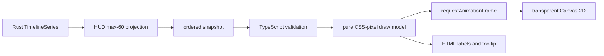

# Tauri migration phase 3: HTML-in-Canvas mini timeline

## Scope

This slice continues only the `hud-spike` window. It adds the existing optional
mini timeline as one hybrid component:

- Rust remains the only source of hit aggregation and timeline bucket meaning;
- Canvas 2D paints the baseline and DPS polyline;
- HTML paints labels, accessible text, and the edit-mode tooltip;
- the egui HUD and its timeline remain intact for comparison;
- persisted HUD editing remains outside this slice.

No drawing dependency is added.

## Contract boundary

`HudSnapshot` v2 adds an optional timeline. Technical contract v4 carries it in
the same ordered, change-driven snapshot. A cheap revision check runs every
100 ms; unchanged state does not rebuild or send the full projection:

```text
HudTimelineSnapshot
├─ bucketSeconds
├─ durationSeconds
├─ peakDps
└─ buckets[0..60]
   ├─ startSeconds
   ├─ endSeconds
   ├─ damage
   ├─ dps
   └─ hits (decimal string)
```

The Rust projection uses the selected global or Abyss-half `TimelineSeries`.
When the source contains more than 60 buckets, adjacent buckets are merged.
Damage and hit totals are preserved, while DPS is recalculated over the merged
wall-clock interval. Preview buckets are also generated in Rust.

The TypeScript boundary rejects unsupported versions, negative/non-finite
numbers, reversed time ranges, invalid hit counters, and more than 60 buckets.

## Render lifecycle



- `ResizeObserver` measures the logical CSS width.
- The backing store uses the current `devicePixelRatio`.
- Data, size, and DPI changes cancel the previous pending frame and draw once in
  the next animation frame.
- Canvas stays pointer-transparent.
- The HTML hit layer is active only in non-passthrough edit mode.
- Component cleanup disconnects the observer, removes the resize listener, and
  cancels pending drawing.
- The initial native height reserves the optional title, status, and timeline
  modules while leaving the default HUD height unchanged.

## Manual validation gate

The default HUD preset may hide the timeline. Before launching Tauri, enable
the existing mini-timeline setting or select the detailed HUD preset in the
current egui settings, save it, and then close the egui program.

Run:

```powershell
pnpm --dir frontend tauri:dev
```

Verify only `hud-spike`:

1. Edit-mode preview shows the mini timeline in the configured module order.
2. Starting capture replaces preview buckets with live DPS buckets within one
   100 ms coalescing window.
3. The displayed peak matches the highest visible downsampled bucket.
4. Moving over the chart in edit mode shows the correct time interval, DPS, and
   damage for the bucket under the pointer.
5. Passthrough mode keeps the chart visible but removes all timeline pointer
   interaction.
6. Repeated resize from narrow to wide does not stretch old pixels or leave
   trails.
7. At 100%, 125%, and 150% DPI, and after moving between displays, the line
   remains crisp and the tooltip remains inside the HUD.
8. On bright and textured game backgrounds, the Canvas remains transparent and
   does not introduce a rectangular fill.
9. Under active capture, ordered snapshots update the line without changing the
   existing summary or character-row cadence.
10. Run an equivalent capture with the egui HUD separately and compare bucket
    timing, relative peaks, module order, and empty/preview behavior.
